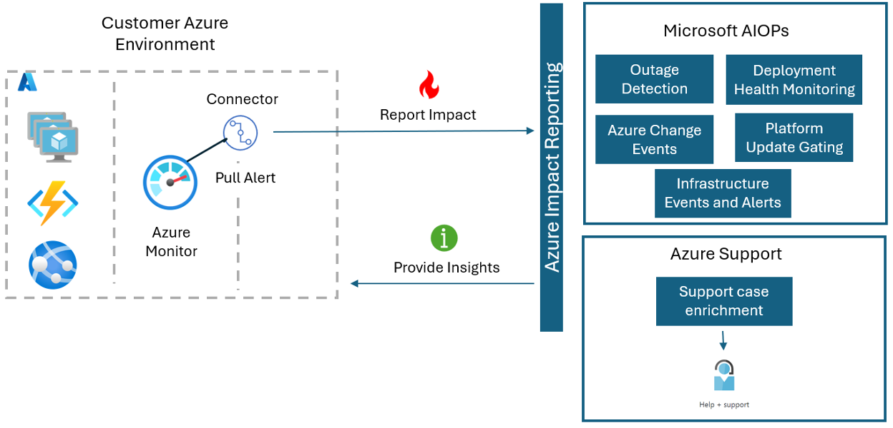

# What is the impact connector for Azure Monitor alerts (preview)?

> [!IMPORTANT]
> Azure Impact Reporting is currently in preview. For legal terms that apply to Azure features that are in beta, in preview, or otherwise not yet released into general availability, see [Supplemental Terms of Use for Microsoft Azure Previews](https://azure.microsoft.com/support/legal/preview-supplemental-terms/).

When you use the impact connector for Azure Monitor alerts, you can seamlessly report the impact from an alert into Microsoft AI operations for change event correlation.

## How connectors work

When you create a connector, it gets associated with a subscription. When alerts whose target resources reside in the specified subscription are fired, an impact report is created through Azure Impact Reporting and sent to Microsoft intelligence systems.

## Related content

* [Create a connector for Azure Monitor alerts](create-azure-monitor-connector.md)
* [Impact Reporting connectors: Troubleshooting guide](connectors-troubleshooting-guide.md)
* [View reported impacts and insights](view-impact-insights.md)
