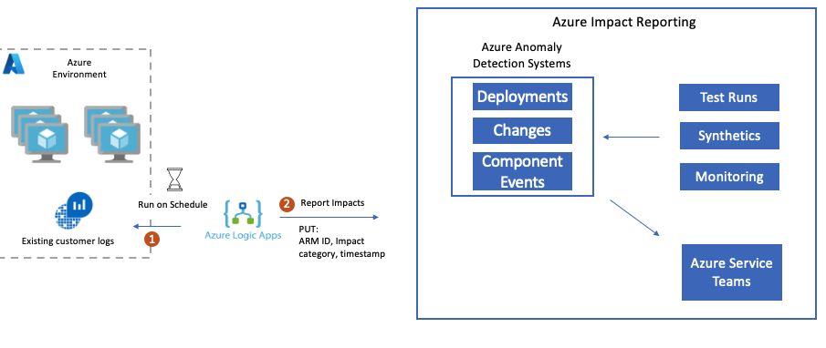

# Report impacts by using a logic app (preview)

> [!IMPORTANT]
> Azure Impact Reporting is currently in preview. For legal terms that apply to Azure features that are in beta, in preview, or otherwise not yet released into general availability, see [Supplemental Terms of Use for Microsoft Azure Previews](https://azure.microsoft.com/support/legal/preview-supplemental-terms/).

To learn more about available impact management actions, see the [API docs](https://aka.ms/ImpactRP/APIDocs).

Use a logic app as a REST client for impact reporting.



## Prerequisites

A managed identity with PUT access to the ImpactRP API and read access to the data source for the workload is required. You also need a query with a one-minute or greater polling interval for the data source to generate the following fields:

- `ImpactName`
- `ImpactStartTime`
- `ImpactedResourceId`
- `WorkloadContext`
- `ImpactCategory`

This article uses a Kusto cluster as an example data source with the following query:

```kusto
ExampleTable
| where Status =~ "BAD" and ingestion_time() > ago(1m)
| distinct  ImpactStartTime=TimeStamp, ImpactedResourceId=ResourceId, WorkloadContext=Feature, ImpactCategory="Resource.Availability", ImpactName = hash_sha1(strcat(TimeStamp, ResourceId , Feature, Computer, ingestion_time()))
```

> [!NOTE]
> Replace the query with one to a datastore or source that Azure Logic Apps supports and that returns the same columns. If all of these columns aren't readily available, add more steps to the workflow to generate the missing fields.

## Create a logic app

1. Create a new logic app in the Azure portal with the following settings:

    - **Publish**: Set to **Workflow**.
    - **Region**: Set to **Central US**.
    - **Plan**: Set to **Standard**.

1. (Optional) Under the **Monitoring** section, set **Enable Application Insights** to **Yes** to enable failure monitoring.

1. Review and create the logic app. After you create it, open the logic app and go to **Settings** > **Identity** on the side pane. In the **User assigned** section, select **Add**, and select the managed identity that you created in the prerequisites. Select **Save** to save the changes.

1. Go to **Workflows** > **Connections**, and select the **JSON View** tab. Create a connection for your data source. This example uses Kusto with the managed identity, but you can use any data source that Logic Apps supports:

    ```json
    {
        "managedApiConnections": {
            "kusto": {
                "api": {
                    "id": "/subscriptions/<subscription_id>/providers/Microsoft.Web/locations/<region>/managedApis/kusto"
                },
                "authentication": {
                    "type": "ManagedServiceIdentity"
                },
                "connection": {
                    "id": "/subscriptions/<subscription_id>/resourceGroups/<rg_name/providers/Microsoft.Web/connections/<connection_name>"
                },
                "connectionProperties": {
                    "authentication": {
                        "audience": "https://kusto.kustomfa.windows.net",
                        "identity": "/subscriptions/<subscription_id>/resourcegroups/<rg_name>/providers/Microsoft.ManagedIdentity/userAssignedIdentities/<managed_identity_name>",
                        "type": "ManagedServiceIdentity"
                    }
                },
                "connectionRuntimeUrl": "<kusto_connection_runtime_url>"
            }
        }
    }
    ```

    Select **Save** to save the changes.

1. Go to **Workflows** > **Workflows,** select **Add**, and create a new blank workflow with **State Type** set as **Stateful**.

1. Select the newly created workflow. Go to **Developer** > **Code** and replace the JSON content with:

    ```json
    {
        "definition": {
            "$schema": "https://schema.management.azure.com/providers/Microsoft.Logic/schemas/2016-06-01/workflowdefinition.json#",
            "actions": {
                "For_each": {
                    "actions": {
                        "HTTP": {
                            "inputs": {
                                "authentication": {
                                    "identity": "/subscriptions/<subscription_id>/resourcegroups/<rg_name>/providers/Microsoft.ManagedIdentity/userAssignedIdentities/<managed_identity_name>",,
                                    "type": "ManagedServiceIdentity"
                                },
                                "body": {
                                    "properties": {
                                        "endDateTime": null,
                                        "impactCategory": "@{items('For_each')?['ImpactCategory']}",
                                        "impactedResourceId": "@{items('For_each')?['ImpactedResourceId']}",
                                        "startDateTime": "@{items('For_each')?['ImpactStartTime']}",
                                        "workload": {
                                            "context": "@{items('For_each')?['WorkloadContext']}"
                                        }
                                    }
                                },
                                "method": "PUT",
                                "retryPolicy": {
                                    "count": 5,
                                    "interval": "PT30M",
                                    "maximumInterval": "PT24H",
                                    "minimumInterval": "PT30M",
                                    "type": "exponential"
                                },
                                "uri": "@{concat('https://management.azure.com/subscriptions/', split(item().ImpactedResourceId, '/')[2], '/providers/Microsoft.Impact/workloadImpacts/', item().ImpactName, '?api-version=2022-11-01-preview')}"
                            },
                            "runAfter": {},
                            "type": "Http"
                        }
                    },
                    "foreach": "@body('Run_KQL_query')?['value']",
                    "runAfter": {
                        "Run_KQL_query": [
                            "Succeeded"
                        ]
                    },
                    "type": "Foreach"
                },
                "Run_KQL_query": {
                    "inputs": {
                        "body": {
                            "cluster": "https://examplecluster.eastus.kusto.windows.net/",
                            "csl": "ExampleTable\n|where Status =~ \"BAD\" and ingestion_time()>ago(1m)\n|distinct  ImpactStartTime=TimeStamp, ImpactedResourceId=ResourceId, WorkloadContext=Feature, ImpactCategory=\"Resource.Availability\", ImpactName = hash_sha1(strcat(TimeStamp, ResourceId , Feature, Computer, ingestion_time()))",
                            "db": "exampledb"
                        },
                        "host": {
                            "connection": {
                                "referenceName": "kusto"
                            }
                        },
                        "method": "post",
                        "path": "/ListKustoResults/false"
                    },
                    "runAfter": {},
                    "type": "ApiConnection"
                }
            },
            "contentVersion": "1.0.0.0",
            "outputs": {},
            "triggers": {
                "Recurrence": {
                    "recurrence": {
                        "frequency": "Minute",
                        "interval": 1
                    },
                    "type": "Recurrence"
                }
            }
        },
        "kind": "Stateful"
    }
    ```

    Select **Save** to save the changes.

1. Go to **Developer** > **Designer**. Select the `Run KQL (Kusto Query Language) Query` block. Replace **Cluster URL** and **Database** with the target Kusto cluster and database. Replace **Query** with the query from the prerequisites.

1. Select the blue **Change connection** link. Set **Authentication** to **Managed identity**. Set **Managed identity** to the managed identity that you created in the prerequisites with an appropriate connection name, and then select **Create**.

    > [!NOTE]
    > If you use a source other than Kusto, replace the `Run KQL Query` block with the appropriate block for your data source. The `For Each` block must be updated to iterate over the results of the query. The `HTTP` block must be updated to use the appropriate data from the query results.

1. (Optional) If the polling interval for the query is greater than one minute, select the `Recurrence` block and set `Interval` to the polling interval in minutes.

1. Select the `HTTP` block and update `Authentication` to the managed identity that you created in the prerequisites. Select **Save** to save the changes.

1. Go to **Overview** and select **Run** to test the flow. The results appear under **Run History**.

1. (Optional) Return to the logic app in the Azure portal. Go to **Settings** > **Application Insights**, and select the hyperlink to the Application Insights resource. Go to **Monitoring** > **Alerts**. Select **Create** > **Alert Rule**. From here, you can create an alert rule to notify on failures.
