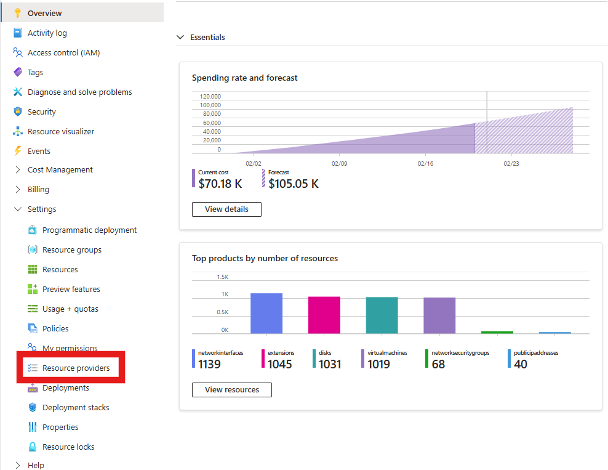

# What is Guest Health Reporting (GHR)? (preview)
> [!IMPORTANT]
> Guest Health Reporting is currently in Preview. See the [Supplemental Terms of Use for Microsoft Azure Previews](https://azure.microsoft.com/support/legal/preview-supplemental-terms/) for legal terms that apply to Azure features that are in beta, preview, or otherwise not yet released into general availability.

The Guest Health Reporting service allows Azure supercomputing customers to provide VM device health statuses to Azure. Based on these status updates, Azure HPC can make decisions to remove problematic nodes out of production and send them for repair.

## Onboarding process

To use Guest Health Reporting to report the health of a node, the subscription that hosts the resources needs to be onboarded to the Impact service using the following steps:

1. Go to the Azure portal -> Subscriptions (select) -> Resource Providers in the left menu.  

2. Search for the `Microsoft.Impact` resource provider.
3. Select and Register it. 

4. Once registered, in the left pane select Settings -> Preview Features, search for "Allow Impact Reporting", select it and select "Register".  

5. Go to the left pane -> Settings -> Overview and retrieve your Subscription ID and send it to the Azure team member assisting you to complete the onboarding process.
6. **Wait for confirmation that the onboarding process is complete before proceeding with using GHR requests submission.**

## Access management and role assignment

To submit GHR requests from a resource within Azure, the appropriate access management roles must be assigned.
1. Create a User or System Assigned Managed Identity.
2. Go to Access Control (IAM) in the left menu -> select Add Role Assignment.  

3. Search for `Impact Reporter` role in the search box and select it.  

4. Go to the Members tab and search for the user-identity/ app-id/ service-principal in the search box and select it -> Select Members. The app-ID is the service-principal for the app to be used for reporting. 
5. Once the app-id/ managed-identity is selected, review-assign it.

## Next steps
* [Report node health](guest-health-impact-report.md)
* [HPC Impact Categories](guest-health-impact-categories.md)
