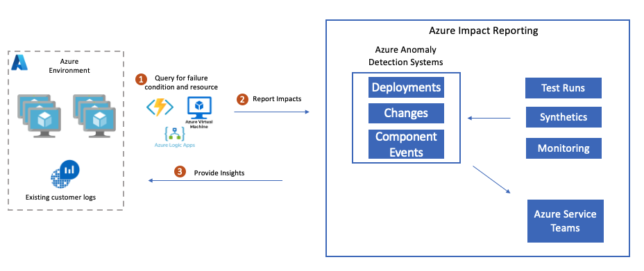

# What is Impact Reporting? (Preview)
> [!IMPORTANT]
> Azure Impact Reporting is currently in Preview. See the [Supplemental Terms of Use for Microsoft Azure Previews](https://azure.microsoft.com/support/legal/preview-supplemental-terms/) for legal terms that apply to Azure features that are in beta, preview, or otherwise not yet released into general availability.

Azure Impact Reporting enables you to leverage Azure Intelligence Systems to enhance your investigations through reporting suspected platform issues. In addition to providing you with insights if found, these impact reports are used in resource health modeling to determine service and resource health.

## What is an "Impact"?

In this context, an impact is any unexpected behavior or issue negatively affecting your workloads suspected to be caused by the platform.

Examples of impacts include:

* Unexpected VM reboot
* Disk IO failures
* High datapath latency 

## Next steps
<!-- Add a context sentence for the following links -->
* [File an impact report](report-impact.md)
<!-- - [View previous impact reports](links-how-to.md) -->
