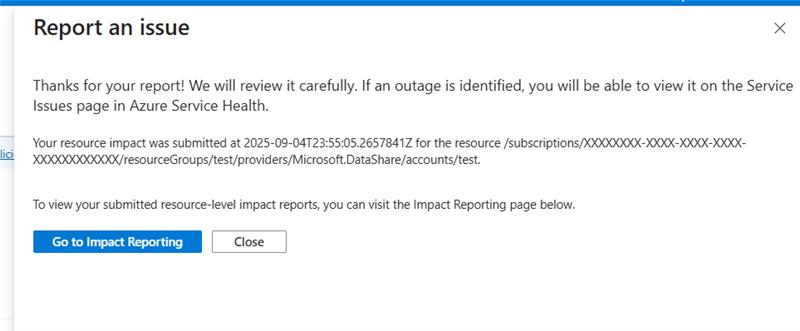

# Report an impact (preview)

> [!IMPORTANT]
> Azure Impact Reporting is currently in preview. For legal terms that apply to Azure features that are in beta, in preview, or otherwise not yet released into general availability, see [Supplemental Terms of Use for Microsoft Azure Previews](https://azure.microsoft.com/support/legal/preview-supplemental-terms/).

You can use the Azure Service Health **Report an issue** pane and the REST API to report an issue. You can also use an Azure Monitor [connector](./azure-monitor-connector.md) to report an impact automatically when certain alerts get triggered.

## Report workload impact

Use the following channels to report a workload:

* Azure Service Health portal pane
* REST API

### [Azure Service Health](#tab/ash/)

To report an issue, follow these steps:

1. Select **Report an issue**.

   [](images/report-an-issue-main.png#lightbox)

1. Select **Single resource**.

   [](images/report-an-issue-submit.png#lightbox)

1. Fill out the required fields:

    - **Subscription**
    - **Impacted resource**
    - **What is the business impact?**
    - **Impact start time**
    - **Impact end time**

1. Select **Submit**.

When your issue is reported, you should see this message.

[](images/report-an-issue-success.png#lightbox)

If an outage is found, you see it in the portal.

If you get the following error, you don't have permission.

[](images/report-an-issue-error.png)

### [REST API](#tab/api/)

> [!TIP]
> Most workloads have monitoring in place to detect failures. When your monitoring identifies a problem that you think the platform caused, create an integration through a logic app or use an Azure function to file an impact report.
>
For more examples, review the full [REST API reference](https://aka.ms/ImpactRP/APIDocs).

```json
{
  "properties": {
    "impactedResourceId": "/subscriptions/<Subscription_id>/resourcegroups/<rg_name>/providers/Microsoft.Compute/virtualMachines/<vm_name>",
    "startDateTime": "2022-11-03T04:03:46.6517821Z",
    "endDateTime": null, //or a valid timestamp if present
    "impactCategory": "Resource.Availability", //valid impact category needed
    "workload": { "name": "webapp/scenario1" }
  }
}
```

```rest
az rest --method PUT --url "https://management.azure.com/subscriptions/<Subscription_id>/providers/Microsoft.Impact/workloadImpacts/<impact_name>?api-version=2022-11-01-preview"  --body <body_above>

```

---

## Related content

- [Get allowed impact category list](view-impact-categories.md)
- [View insights from reported issues](view-impact-insights.md)
