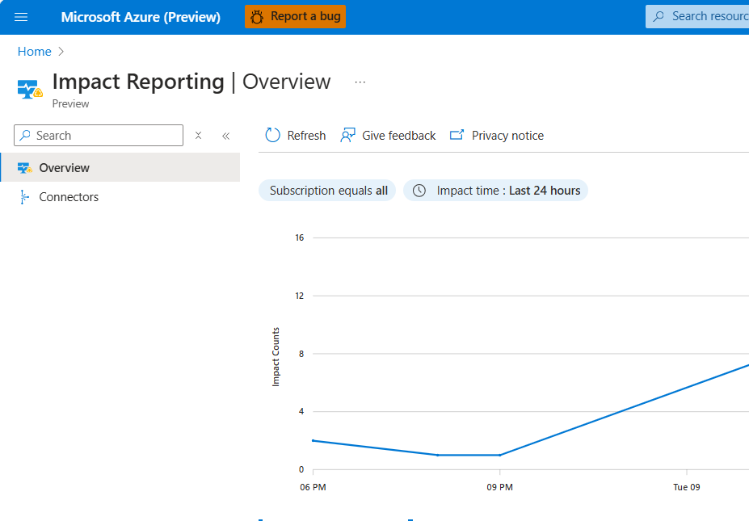

# View impact reports and insights (preview)

> [!IMPORTANT]
> Azure Impact Reporting is currently in preview. For legal terms that apply to Azure features that are in beta, preview, or otherwise not yet released into general availability, see [Supplemental Terms of Use for Microsoft Azure Previews](https://azure.microsoft.com/support/legal/preview-supplemental-terms/).

You can view previously submitted impact reports and insights through the REST API, Azure Resource Graph Explorer, and the Azure portal.

## Permissions needed

You need either the Impact Reporter role or the `read` action on `Microsoft.Impact/WorkloadImpact/*` at the appropriate scope (root, subscription, or resource group).

Use the following channels to view impact reports or insights:

* Azure portal
* Azure Resource Graph query
* REST API

### [Portal](#tab/portal/)

1. Go to the **Azure Impact Reporting** portal. Look for your subscription, and select the date range.

    [](images/impact-reporting-portal.png#lightbox)
1. To view the insights generated from the impacts, go to the bottom of the page. The tabular view shows the count of the insights for each resource name.

    [](images/insights.png#lightbox)
1. Select the insight count to see recommended actions for each of the insights.

### [REST API](#tab/restapi/)

#### View impacts by using the REST API

You can use the Impact Reporting REST API to view previously filed impact reports. For more information, review the full [REST API reference](https://aka.ms/ImpactRP/APIDocs).

#### View a single impact report

For more information, see the [REST API reference](https://aka.ms/ImpactRP/APIDocs).

```rest
az rest --method GET --url "https://management.azure.com/subscriptions/<Subscription_id>/providers/Microsoft.Impact/workloadImpacts/<impact_name>?api-version=2022-11-01-preview" 
```

#### Response

```json
{
  "id": "/subscriptions/<Subscription_id>/providers/Microsoft.Impact/workloadImpacts/Impact02",
  "name": "Impact02",
  "type": "microsoft.impact/workloadimpacts",
  "systemData": {
    ...
  },
  "properties": {
    "impactedResourceId": "/subscriptions/<Subscription_id>/resourceGroups/<rg-name>/providers/Microsoft.Compute/virtualMachines/<vm-name>",
    "startDateTime": "2022-11-14T05:59:46.6517821Z",
    "endDateTime": null,
    "impactDescription": "something's not right",
    "impactCategory": "Resource.Performance",
    "workload": {
      "context": "myCompany/scenario1",
      "toolset": "REST"
    },
    "provisioningState": "Succeeded",
    "impactUniqueId": "1234n98-8dc8-4c52-8ce2-6fa86e6rs",
    "reportedTimeUtc": "2022-11-14T20:55:38.7667873Z"
  }
}
```

### [Azure Resource Graph](#tab/arg/)

To run these queries, in the Azure portal, go to the [Azure Resource Graph Explorer query pane](https://portal.azure.com/#view/HubsExtension/ArgQueryBlade).

#### Get all impact reports that have insights

This query retrieves all impact reports with insights. They show key details such as the resource ID and impact properties.

```kql
impactreportresources 
|where ['type'] =~ 'microsoft.impact/workloadimpacts'
|extend startDateTime=todatetime(properties["startDateTime"])
|extend impactedResourceId=tolower(properties["impactedResourceId"])
|join kind=inner hint.strategy=shuffle (impactreportresources
|where ['type'] =~ 'microsoft.impact/workloadimpacts/insights'
|extend insightCategory=tostring(properties['category'])
|extend eventId=tostring(properties['eventId'])
|project impactId=tostring(properties["impact"]["impactId"]), insightProperties=properties, insightId=id) on $left.id == $right.impactId
|project impactedResourceId, impactId, insightId, insightProperties, impactProperties=properties
```

#### For a resource URI, find all reported impacts and insights

When you give this query a resource ID, it retrieves impact reports and insights that include the specified resource ID.

```kql
impactreportresources 
|where ['type'] =~ 'microsoft.impact/workloadimpacts'
|extend startDateTime=todatetime(properties["startDateTime"])
|extend impactedResourceId=tolower(properties["impactedResourceId"])
|where impactedResourceId =~ '<***resource_uri***>'
|join kind=leftouter  hint.strategy=shuffle (impactreportresources
|where ['type'] =~ 'microsoft.impact/workloadimpacts/insights'
|extend insightCategory=tostring(properties['category'])
|extend eventId=tostring(properties['eventId'])
|project impactId=tostring(properties["impact"]["impactId"]), insightProperties=properties, insightId=id) on $left.id == $right.impactId
|project impactedResourceId, impactId=id, insightId, insightProperties, impactProperties=properties
|order by insightId desc
```

---

## Related content

* [What is an Impact Reporting connector for Azure Monitor alerts?](azure-monitor-connector.md)
* [Impact Reporting connectors: Troubleshooting guide](connectors-troubleshooting-guide.md)
* [Get the allowed impact category list](view-impact-categories.md)