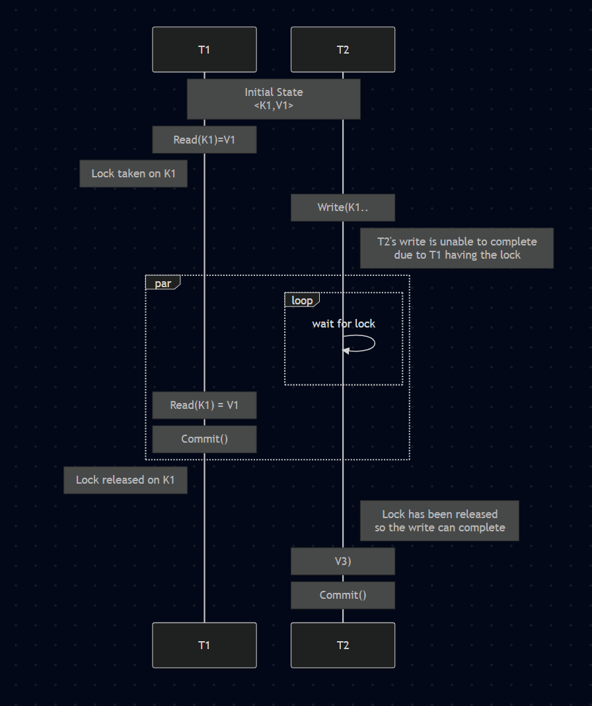
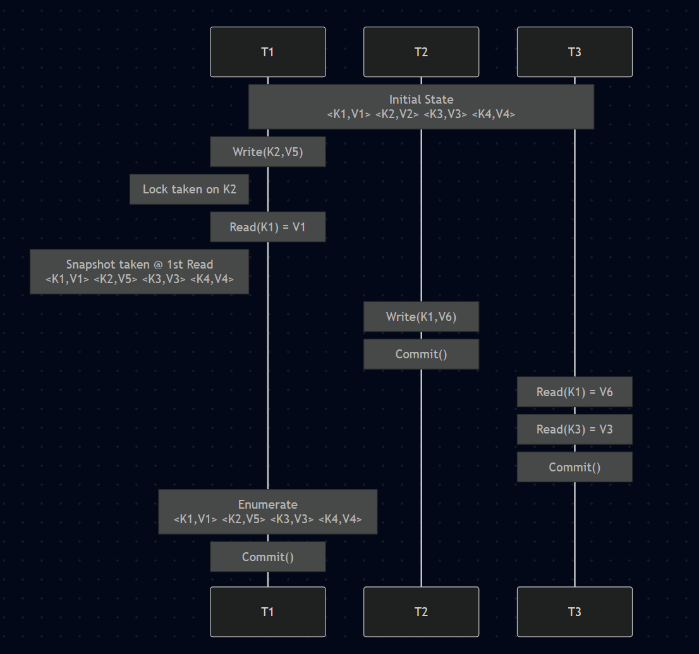

# Transactions and lock modes in Azure Service Fabric Reliable Collections

## Transaction

A transaction is a sequence of operations performed as a single logical unit of work. It exhibits the common [ACID](https://en.wikipedia.org/wiki/ACID) (*atomicity*, *consistency*, *isolation*, *durability*) properties of database transactions:

* **Atomicity**: A transaction must be an atomic unit of work. In other words, either all its data modifications are performed, or none of them is performed.
* **Consistency**: When completed, a transaction must leave all data in a consistent state. All internal data structures must be correct at the end of the transaction.
* **Isolation**: Modifications made by concurrent transactions must be isolated from the modifications made by any other concurrent transactions. The isolation level used for an operation within an [ITransaction](/dotnet/api/microsoft.servicefabric.data.itransaction) is determined by the [IReliableState](/dotnet/api/microsoft.servicefabric.data.ireliablestate) performing the operation.
* **Durability**: After a transaction completes, its effects are permanently in place in the system. The modifications persist even in the event of a system failure.

### Isolation levels

Isolation level defines the degree to which the transaction must be isolated from modifications made by other transactions.
There are two isolation levels that are supported in Reliable Collections:

* **Repeatable Read**: Specifies that statements can't read data that has been modified but not yet committed by other transactions and that no other transactions can modify data that has been read by the current transaction until the current transaction finishes.
    * Benefits of Read Repeatable Transactions:
         * Lower memory footprint than snapshot transactions
         * Ensures consistent return of values for multiple reads at a given time
     * Considerations for Read Repeatable Transactions:
         * Writes are blocked while there's an active read of the data
         * Reads are also blocked while there's an active write of the data. 
* **Snapshot**: Specifies that data read by any statement in a transaction is the transactionally consistent version of the data that existed at the start of the transaction.
  The transaction can recognize only data modifications that were committed before the first read of the transaction.
  Data modifications made by other transactions after the start of the current transaction aren't visible to statements executing in the current transaction.
  The effect is as if the statements in a transaction get a snapshot of the committed data as it existed at the start of the transaction.
  Snapshots are consistent across Reliable Collections.
    * Benefits of Snapshot Transactions:
         * Allows for writes even when a value has been read in an uncommitted transaction
     *  Considerations for Snapshot Transactions:
         * Long running snapshot transactions can result in a large memory footprint for the service as more values are moved into memory to maintain the snapshot isolation
         * Different transactions can return different values for read data depending on when the snapshot was taken

Reliable Collections automatically choose the isolation level to use for a given read operation depending on the operation and the role of the replica at the time of transaction's creation.
Following is the table that depicts isolation level defaults for Reliable Dictionary and Queue operations.

| Operation \ Role | Primary | Secondary |
| --- |:--- |:--- |
| Single Entity Read |Repeatable Read |Snapshot |
| Enumeration, Count |Snapshot |Snapshot |

> [!NOTE]
> Common examples for Single Entity Operations are `IReliableDictionary.TryGetValueAsync`, `IReliableQueue.TryPeekAsync`.
> 

Both the Reliable Dictionary and the Reliable Queue support *Read Your Writes*.
In other words, any write within a transaction will be visible to a following read
that belongs to the same transaction.

### Example repeatable read behavior

In this example you can see that T2 is prevented from acquiring a lock on K1 until T1 Commits since T1 currently holds a read lock on the key. 
### Example snapshot behavior

In this example you can see that even though T2 has updated the value of K1 to V6, T2 still enumerates K1 as V1 while still being aware its own change to K2. T3 is unaffected since it reads keys that don't have any current write locks. 

## Locks

In Reliable Collections, all transactions implement rigorous two phase locking: a transaction doesn't release the locks it has acquired until the transaction terminates with either an abort or a commit.

Reliable Dictionary uses row-level locking for all single entity operations.
Reliable Queue trades off concurrency for strict transactional FIFO property.
Reliable Queue uses operation-level locks allowing one transaction with `TryPeekAsync` and/or `TryDequeueAsync` and one transaction with `EnqueueAsync` at a time.
Note that to preserve FIFO, if a `TryPeekAsync` or `TryDequeueAsync` ever observes that the Reliable Queue is empty, they'll also lock `EnqueueAsync`.

Write operations always take Exclusive locks.
For read operations, the locking depends on a couple of factors:

- Any read operation done using Snapshot isolation is lock-free.
- Any Repeatable Read operation by default takes Shared locks.
- However, for any read operation that supports Repeatable Read, the user can ask for an Update lock instead of the Shared lock.
An Update lock is an asymmetric lock used to prevent a common form of deadlock that occurs when multiple transactions lock resources for potential updates at a later time.

The lock compatibility matrix can be found in the following table:

| Request \ Granted | None | Shared | Update | Exclusive |
| --- |:--- |:--- |:--- |:--- |
| Shared |No conflict |No conflict |Conflict |Conflict |
| Update |No conflict |No conflict |Conflict |Conflict |
| Exclusive |No conflict |Conflict |Conflict |Conflict |

The timeout argument in Reliable Collections APIs is used for deadlock detection.
For example, two transactions (T1 and T2) are trying to read and update K1.
It's possible for them to deadlock, because they both end up having the Shared lock.
In this case, one or both of the operations will time out. In this scenario, an Update lock could prevent such a deadlock.

## Next steps

* [Working with Reliable Collections](service-fabric-work-with-reliable-collections.md)
* [Reliable Services notifications](service-fabric-reliable-services-notifications.md)
* [Reliable Services backup and restore (disaster recovery)](service-fabric-reliable-services-backup-restore.md)
* [Reliable State Manager configuration](service-fabric-reliable-services-configuration.md)
* [Developer reference for Reliable Collections](/dotnet/api/microsoft.servicefabric.data.collections#microsoft_servicefabric_data_collections)
