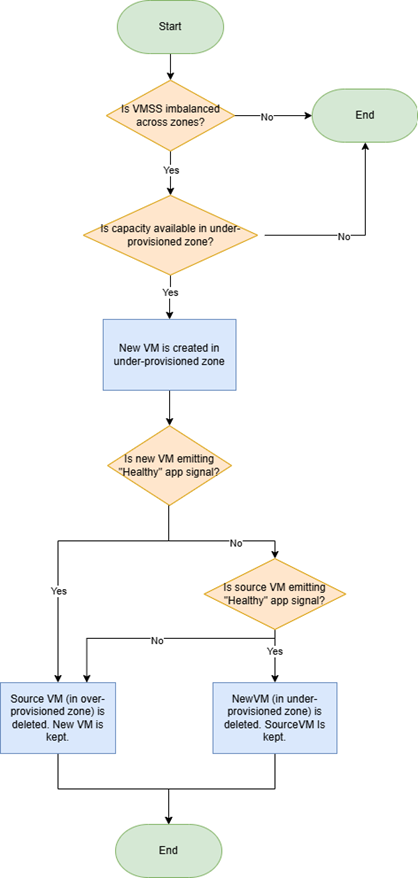

# Automatic zone balance for Azure Virtual Machine Scale Sets (Preview)

Automatic zone balance helps you maintain zone-resilient scale sets that are evenly distributed across availability zones. This feature proactively monitors and redistributes VMs to maximize resiliency and fault tolerance, reducing the risk of zonal imbalance due to capacity constraints or scaling operations.

> [!NOTE]
> Automatic zone balance does not monitor VM health for zonal outages and should not be used as a zone-down recovery mechanism.

## Background

When you deploy a Virtual Machine Scale Set (VMSS) across multiple availability zones, the scale set attempts to maximize resiliency by spreading your VMs as evenly as possible. However, factors like capacity constraints or scaling operations can cause your scale set to become "zonally imbalanced" over time, with some zones having more VM instances than others. This imbalance can go unnoticed, but it increases the risk that a single zone failure could impact a disproportionate number of your VMs, reducing your application's availability. 

Auto AZ Balance is designed to help improve zonal resiliency by monitoring your VMSS and automatically redistributing VMs as needed to maintain an even spread across zones. 

Key Terms:
- A scale set is considered "zonally balanced" if each zone has the same number of VMs +/- 1 VM as all other zones for the scale set. A scale set that does not meet this condition will be considered "zonally imbalanced". More details on zone balance available [here](./virtual-machine-scale-sets-use-availability-zones.md#zone-balancing).
- An "under-provisioned zone" is an availability zone with the fewest VM scale set instances.
  - In a scale set with 1 VM in zone 1, 3 VMs in zone 2, and 3 VMs in zone 3 -- zone 1 is the under-provisioned zone. 
- An "over-provisioned zone" is an availability zone with the most VM scale set instances.
  - In a scale set with 1 VM in zone 1, 3 VMs in zone 2, and 3 VMs in zone 3 -- zones 2 and 3 are the over-provisioned zones.

## How does automatic zone balance work? 

Auto AZ Balance is currently designed for stateless workloads running on existing zonal Virtual Machine Scale Sets (VMSS). The rebalancing process works by moving VMs across availability zones using a create before delete approach, ensuring minimal disruption to your applications.

When a zonal imbalance is detected, Auto AZ Balance creates a new VM in the most under-provisioned zone (the zone with the fewest VM instances) and, once the new VM is healthy, deletes a VM from the most over-provisioned zone (the zone with the most VM instances). Only one VM is rebalanced at a time, and new VMs are always created with the latest SKU specified in your VMSS model.

After creating a new VM, Auto AZ Balance waits up to 90 minutes for it to report a healthy application signal. If the new VM becomes healthy, the original VM in the over-provisioned zone is deleted. If the new VM does not become healthy within 90 minutes, Auto AZ Balance checks the health of the original VM: if the original VM is healthy, the new (unhealthy) VM is deleted; if the original VM is unhealthy, it is deleted and the new VM is kept. This workflow helps maintain zone balance while prioritizing workload health and availability.



## Requirements

**Enable application health monitoring for the scale set**

The scale set must have application health monitoring enabled to use automatic zone balance. Health monitoring can be done using either [Application Health Extension](./virtual-machine-scale-sets-health-extension.md) or [Load Balancer Health Probes](/azure/load-balancer/load-balancer-custom-probe-overview), where only one can be enabled at a time. 

The application health status is used to ensure that new VMs created during the rebalance process are successful and "healthy", before the original VMs are removed. 

**Configure the scale set with at least two availability zones**

The Virtual Machine Scale Set must be zonal with at least two availability zones configured (for example, `zones = [1, 2]`). This ensures that VMs can be distributed across multiple zones for resiliency.

**Specify a SKU for the scale set**

The Virtual Machine Scale Set must have a SKU configured. The SKU determines the VM size and capabilities, and is required for creating and rebalancing VMs.

**Use supported Compute API version**

Automatic zone balance is supported for Compute API version 2024-07-01 or higher. 

**Register the subscription with AFEC**

The subscription must be registered with the Azure Feature Exposure Control (AFEC) flag `Microsoft.Compute.AutomaticZoneRebalancing`. This registration is required to enable the automatic zone balance feature for your subscription.

## Benefits

- Maintains even VM distribution across availability zones for high resiliency.
- Automatically detects and rebalances imbalanced scale sets when possible.
- Simplifies deployment and maintenance of highly available workloads.
- Supported on Virtual Machine Scale Sets with Uniform and Flexible orchestration modes.

## Limitations

- Recommended for stateless workloads only. Rebalancing uses delete and recreate operations; instance IDs, networking, and disks are not preserved.
- Best-effort operation: rebalancing may be delayed if an availability zone has limited capacity.
- Subject to subscription quota limits. Rebalancing requires enough quota to temporarily exceed current VM count.
- [Virtual Machine Scale Sets Flexible] New VMs use the latest SKU in the Virtual Machine Scale Set model. Attached VMs with unique SKUs will not retain their SKU after rebalancing.
  - To protect specific VMs from rebalancing, apply instance protection policy.
- Not available for stateful workloads (disks cannot be moved across availability zones while preserving resource/disk ID).

## Current state (Phase 1 Preview)

Phase 1 of automatic zone balance is in development, targeting Preview in October 2024.

## Available regions

Automatic zone balance is available in all public Azure regions.

## API template example

```json
"resiliencyPolicy": {
  "AutomaticZoneRebalancingPolicy": {
    "Enabled": <bool>,
    "RebalanceStrategy": "Recreate",
    "RebalanceBehavior": "CreateBeforeDelete"
  }
}
```

### Parameters

- **Enabled**: Boolean flag to enable automatic zone balance for the Virtual Machine Scale Set.
- **RebalanceStrategy**: `Recreate` replaces VMs by creating new ones with the same SKU (stateless workloads only).
- **RebalanceBehavior**: `CreateBeforeDelete` creates new instances and waits for readiness before deleting the source VM (may temporarily increase capacity and costs).

## Onboarding (AFEC registration)

Automatic zone balance requires AFEC registration, which is currently auto-approved. Use the ARM Geneva extension to apply the AFEC to your subscription.

- Ensure you have JIT access before submitting the AFEC request: [AFEC JIT Access](https://eng.ms/docs/products/arm/rp_onboarding/afec/afec_jit)
- Namespace: `microsoft.compute`
- Flag Name: `AutomaticZoneRebalancing`
- For detailed steps, see [Enroll & Self-Service Automatic Zone Rebalancing | RSM Documentation](#).

For questions or issues, contact AzRebalanceTeam@service.microsoft.com.