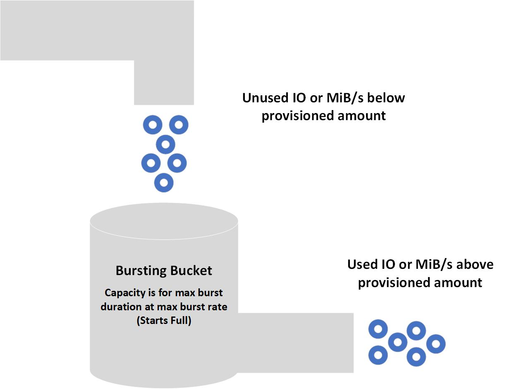
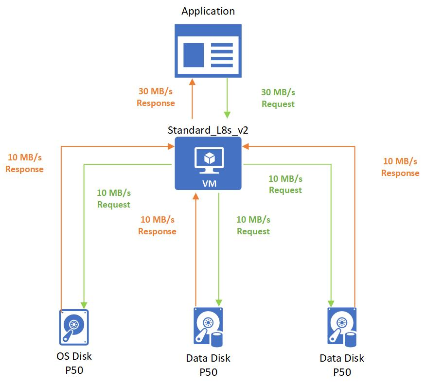
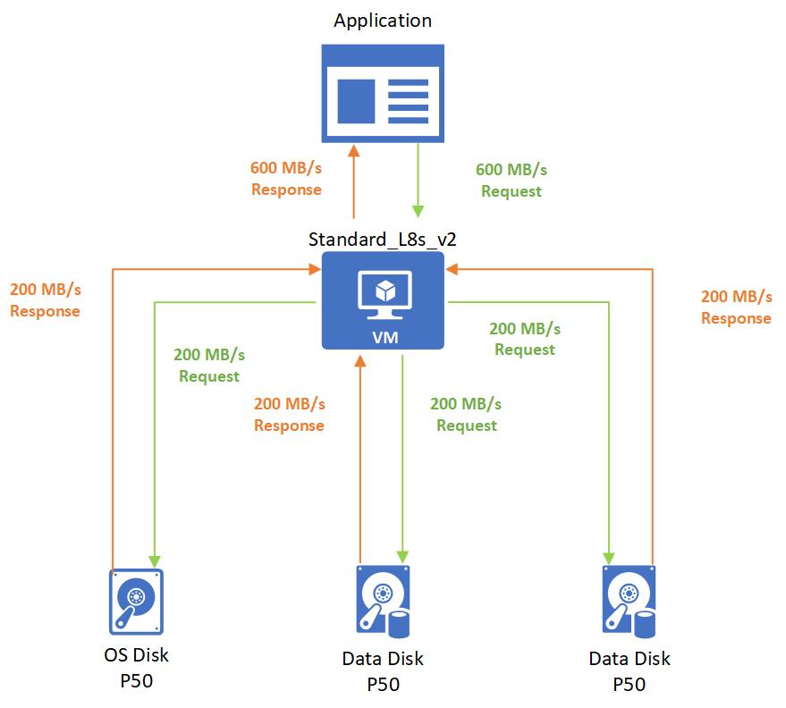
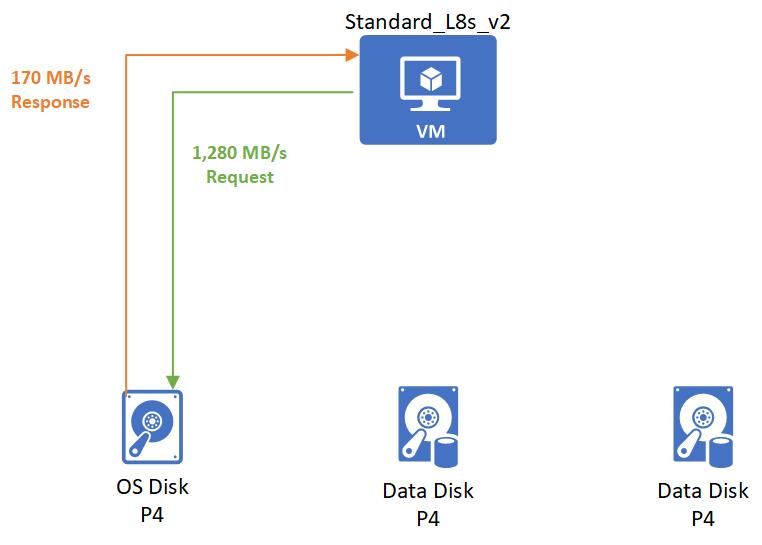
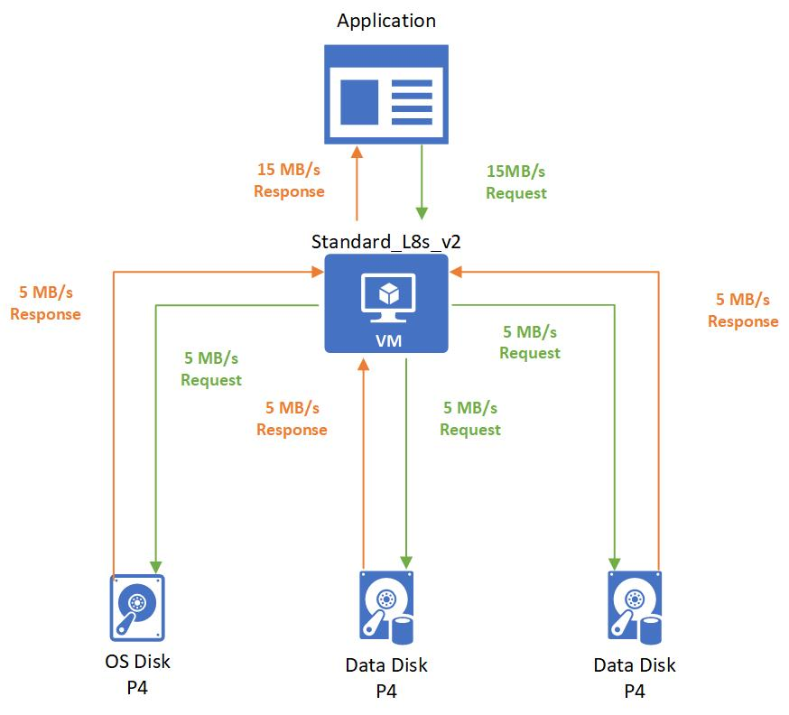

# Managed disk bursting

**Applies to:** :heavy_check_mark: Linux VMs :heavy_check_mark: Windows VMs :heavy_check_mark: Flexible scale sets :heavy_check_mark: Uniform scale sets

Azure offers the ability to boost disk storage IOPS and MB/s performance, this is referred to as bursting for both virtual machines (VM) and disks. You can effectively use VM and disk bursting to achieve better bursting performance on both your VMs and disk.

Bursting for Azure VMs and disk resources aren't dependent on each other. You don't need a burst-capable VM for an attached burst-capable disk to burst. Similarly, you don't need a burst-capable disk attached to your burst-capable VM for the VM to burst.

## Common scenarios
The following scenarios can benefit greatly from bursting:
- **Improve startup times**  – With bursting, your instance starts up faster. For example, the default OS disk for premium enabled VMs is the P4 disk, which is a provisioned performance of up to 120 IOPS and 25 MB/s. With bursting, the P4 can go up to 3,500 IOPS and 170 MB/s, so startup accelerates by up to 6x.
- **Handle batch jobs** – Some application workloads are cyclical in nature. They require a baseline performance most of the time, and higher performance for short periods of time. An example of this nature is an accounting program that processes daily transactions that require a small amount of disk traffic. At the end of the month, this program completes reconciling reports that need a much higher amount of disk traffic.
- **Traffic spikes** – Web servers and their applications can experience traffic surges at any time. If your web server is backed by VMs or disks that use bursting, the servers are better equipped to handle traffic spikes. 

## Disk-level bursting

Currently, two managed disk types support bursting: [Premium SSD managed disks](disks-types.md#premium-ssds) and [Standard SSDs](disks-types.md#standard-ssds). Other disk types don't support bursting. There are two models of bursting for disks:

- An on-demand bursting model, where the disk bursts whenever its needs exceed its current capacity. This model incurs extra charges anytime the disk bursts. On-demand bursting is only available for Premium SSDs larger than 512 GiB.
- A credit-based model, where the disk bursts only if it has burst credits accumulated in its credit bucket. This model doesn't incur extra charges when the disk bursts. Credit-based bursting operates on a best effort basis and isn't guaranteed. Credit-based bursting is only available for Premium SSD managed disks 512 GiB and smaller, and Standard SSDs 1,024 GiB and smaller.

Azure [Premium SSD managed disks](disks-types.md#premium-ssds) can use either bursting model, but [Standard SSDs](disks-types.md#standard-ssds) currently only offer credit-based bursting.

You can also [change the performance tier of managed disks](disks-change-performance.md), which could be ideal if your workload would otherwise be running in burst.

|  |Credit-based bursting  |On-demand bursting  |Changing performance tier  |
|---------|---------|---------|---------|
| **Scenarios**|Ideal for short-term scaling (30 minutes or less).|Ideal for short-term scaling(Not time restricted).|Ideal if your workload would otherwise continually be running in burst.|
|**Cost**     |Free         |Cost is variable, see the [Billing](#billing) section for details.        |The cost of each performance tier is fixed, see [managed disk pricing](https://azure.microsoft.com/pricing/details/managed-disks/) for details.         |
|**Availability**     |Only available for Premium SSD managed disks 512 GiB and smaller, and Standard SSDs 1,024 GiB and smaller.         |Only available for Premium SSD managed disks larger than 512 GiB.         |Available to all Premium SSD sizes.         |
|**Enablement**     |Enabled by default on eligible disks.         |Must be enabled by user.         |User must manually change their tier.         |

### On-demand bursting

Premium SSD managed disks that use the on-demand bursting model of disk bursting can burst beyond the original provisioned targets as often as their workload needs, up to the maximum burst target. For example, on a 1-TiB P30 disk, the provisioned IOPS is 5,000 IOPS. When you enable disk bursting on this disk, your workloads can send IOs to this disk up to the maximum burst performance of 30,000 IOPS and 1,000 MBps. For the maximum burst targets on each supported disk, see [Scalability and performance targets for VM disks](/azure/virtual-machines/disks-scalability-targets#premium-ssd-managed-disks-per-disk-limits).

If you expect your workloads to frequently run beyond the provisioned performance target, disk bursting isn't cost-effective. In this case, change your disk's performance tier to a [higher tier](/azure/virtual-machines/disks-performance-tiers) for better baseline performance. Review your billing details and assess that against the traffic pattern of your workloads.

Before you enable on-demand bursting, understand the following:

[!INCLUDE [managed-disk-bursting-regions-limitations](includes/managed-disk-bursting-regions-limitations.md)]

#### Billing

Premium SSD managed disks using the on-demand bursting model are charged an hourly burst enablement flat fee and transaction costs apply to any burst transactions beyond the provisioned target. Transaction costs are charged using the pay-as-you go model, based on uncached disk IOs, including both reads and writes that exceed provisioned targets. The following is an example of disk traffic patterns over a billing hour:

Disk configuration: Premium SSD – 1 TiB (P30), Disk bursting enabled.

- 00:00:00 – 00:10:00 Disk IOPS below provisioned target of 5,000 IOPS 
- 00:10:01 – 00:10:10 Application issued a batch job causing the disk IOPS to burst at 6,000 IOPS for 10 seconds 
- 00:10:11 – 00:59:00 Disk IOPS below provisioned target of 5,000 IOPS 
- 00:59:01 – 01:00:00 Application issued another batch job causing the disk IOPS to burst at 7,000 IOPS for 60 seconds 

In this billing hour, the cost of bursting consists of two charges:

The first charge is the burst enablement flat fee of $X (determined by your region). This flat fee is always charged on the disk regardless of the attach status until you disable it. 

Second is the burst transaction cost. Disk bursting occurred in two time slots. From 00:10:01 – 00:10:10, the accumulated burst transaction is (6,000 – 5,000) X 10 = 10,000. From 00:59:01 – 01:00:00, the accumulated burst transaction is (7,000 – 5,000) X 60 = 120,000. The total burst transactions are 10,000 + 120,000 = 130,000. Burst transaction cost is charged at $Y based on 13 units of 10,000 transactions (based on regional pricing).

With that, the total cost on disk bursting of this billing hour equals to $X + $Y. The same calculation applies for bursting over provisioned target of MBps. The overage of MB is translated to transactions with IO size of 256 KB. If your disk traffic exceeds both provisioned IOPS and MBps target, you can refer to the following example to calculate the burst transactions. 

Disk configuration: Premium SSD – 1 TB (P30), Disk bursting enabled.

- 00:00:01 – 00:00:05 Application issued a batch job causing the disk IOPS to burst at 10,000 IOPS and 300 MBps for five seconds.
- 00:00:06 – 00:00:10 Application issued a recovery job causing the disk IOPS to burst at 6,000 IOPS and 600 MBps for five seconds.

The burst transaction is accounted as the max number of transactions from either IOPS or MBps bursting. From 00:00:01 – 00:00:05, the accumulated burst transaction is Max((10,000 – 5,000), (300 - 200) * 1024 / 256)) * 5 = 25,000 transactions. From 00:00:06 – 00:00:10, the accumulated burst transaction is Max((6,000 – 5,000), (600 - 200) * 1024 / 256)) * 5 = 8,000 transactions. On top of that, you include the burst enablement flat fee to get the total cost for enabling on-demand based disk bursting. 

For details on pricing, see the [managed disks pricing page](https://azure.microsoft.com/pricing/details/managed-disks/). Use the [Azure Pricing Calculator](https://azure.microsoft.com/pricing/calculator/?service=storage) to make the assessment for your workload. 

To enable on-demand bursting, see [Enable on-demand bursting](/azure/virtual-machines/disks-enable-bursting).

### Credit-based bursting

For Premium SSD managed disks, credit-based bursting is available for disk sizes P20 and smaller. For Standard SSDs, credit-based bursting is available for disk sizes E30 and smaller. For both standard and Premium SSD managed disks, credit-based bursting is available in all regions in Azure Public, Government, and China Clouds. By default, disk bursting is enabled on all new and existing deployments of supported disk sizes. VM-level bursting only uses credit-based bursting.

## Virtual machine-level bursting

VM-level bursting only uses the credit-based model for bursting. It's enabled by default for most Premium Storage supported VMs.

## Bursting flow

The bursting credit system applies in the same manner at both the VM level and disk level. Your resource, either a VM or disk, starts with fully stocked credits in its own burst bucket. These credits allow you to burst for up to 30 minutes at the maximum burst rate. You accumulate credits whenever the resource's IOPS or MB/s are below the resource's performance target. If your resource accrues bursting credits and your workload needs extra performance, your resource can use those credits to go above its performance limits on a best-effort basis to help meet workload demands.

How you spend your available credits is up to you. You can use your 30 minutes of burst credits consecutively or sporadically throughout the day. When you deploy resources, they come with a full allocation of credits. When those credits deplete, it takes less than a day to restock. You can spend credits at your discretion. The burst bucket doesn't need to be full in order for resources to burst. Burst accumulation varies depending on each resource, since it's based on unused IOPS and MB/s below their performance targets. Higher baseline performance resources accrue their bursting credits faster than lower baseline performing resources. For example, a P1 disk idling accrues 120 IOPS per second, whereas an idling P20 disk accrues 2,300 IOPS per second.

## Bursting states
There are three states your resource can be in with bursting enabled:
- **Accruing** – The resource’s IO traffic uses less than the performance target. Accumulating bursting credits for IOPS and MB/s are done separately from one another. Your resource can be accruing IOPS credits and spending MB/s credits or vice versa.
- **Bursting** – The resource’s traffic uses more than the performance target. The burst traffic independently consumes credits from IOPS or bandwidth.
- **Constant** – The resource’s traffic is exactly at the performance target.

## Bursting examples

The following examples show how bursting works with various VM and disk combinations. To make the examples easy to follow, they focus on MB/s, but the same logic is applied independently to IOPS.

### Burstable virtual machine with nonburstable disks
**VM and disk combination:** 
- Standard_L8s_v2 
    - Uncached MB/s: 160
    - Max burst MB/s: 1,280
- P50 OS Disk
    - Provisioned MB/s: 250 
    - On-Demand Bursting: **not enabled**
- 2 P50 Data Disks 
    - Provisioned MB/s: 250
    - On-Demand Bursting: **not enabled**

 After the initial boot up, an application runs on the VM and has a noncritical workload. This workload requires 30 MB/s that gets spread evenly across all the disks.

Then the application needs to process a batched job that requires 600 MB/s. The Standard_L8s_v2 bursts to meet this demand and then requests to the disks get evenly spread out to P50 disks.

### Burstable virtual machine with burstable disks
**VM and disk combination:** 
- Standard_L8s_v2 
    - Uncached MB/s: 160
    - Max burst MB/s: 1,280
- P4 OS Disk
    - Provisioned MB/s: 25
    - Max burst MB/s: 170 
- 2 P4 Data Disks 
    - Provisioned MB/s: 25
    - Max burst MB/s: 170 

When the VM starts, it bursts to request its burst limit of 1,280 MB/s from the OS disk, and the OS disk responds with its burst performance of 170 MB/s.

After startup, you start an application that has a noncritical workload. This application requires 15 MB/s that gets spread evenly across all the disks.

Then the application needs to process a batched job that requires 360 MB/s. The Standard_L8s_v2 bursts to meet this demand and then requests. Only 20 MB/s are needed by the OS disk. The remaining 340 MB/s are handled by the bursting P4 data disks.

## Next steps

- To enable on-demand bursting, see [Enable on-demand bursting](disks-enable-bursting.md).
- To learn how to gain insight into your bursting resources, see [Disk bursting metrics](disks-metrics.md).
- To see exactly how much each applicable disk size can burst, see [Scalability and performance targets for VM disks](disks-scalability-targets.md).

