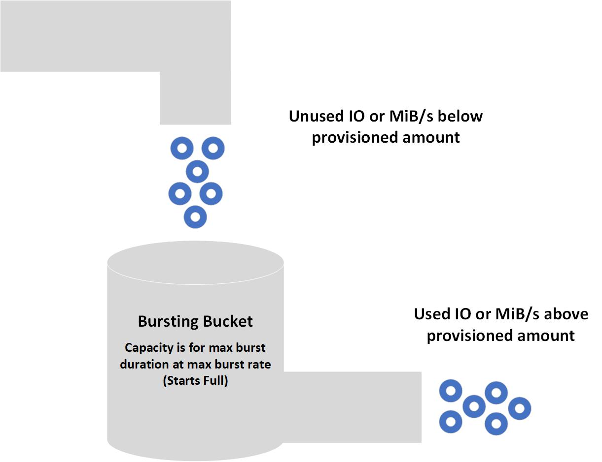
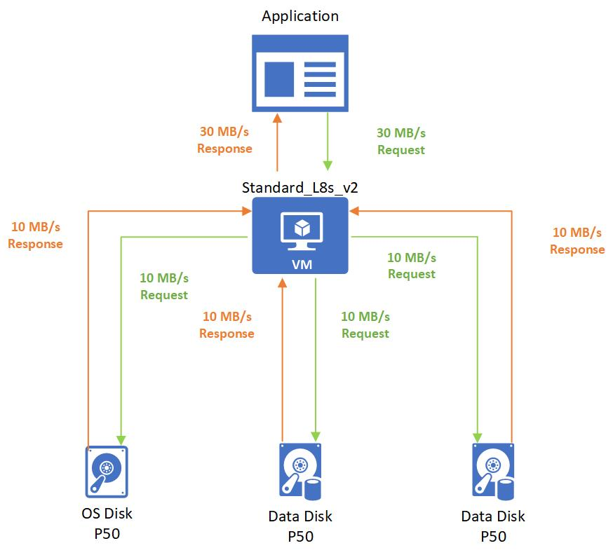
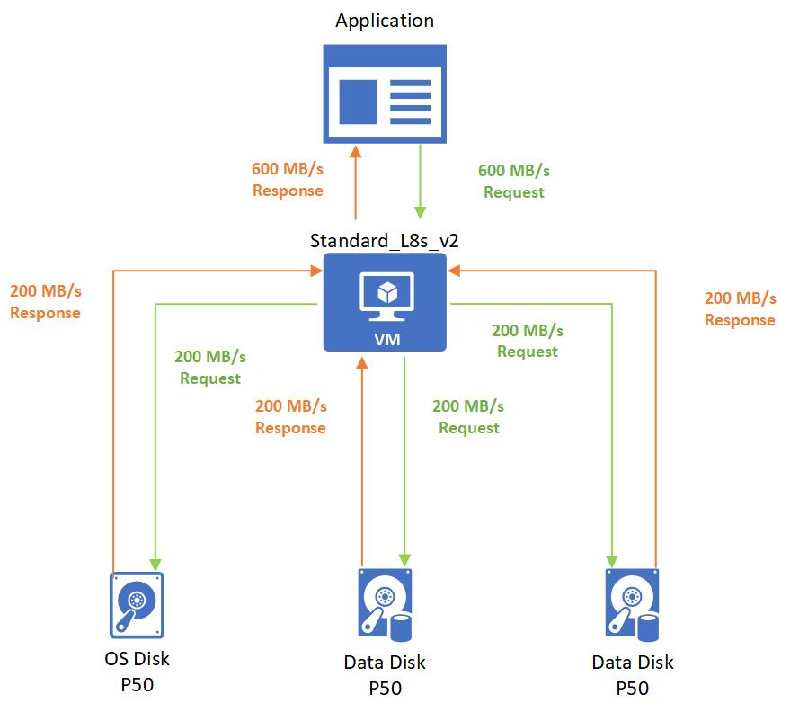
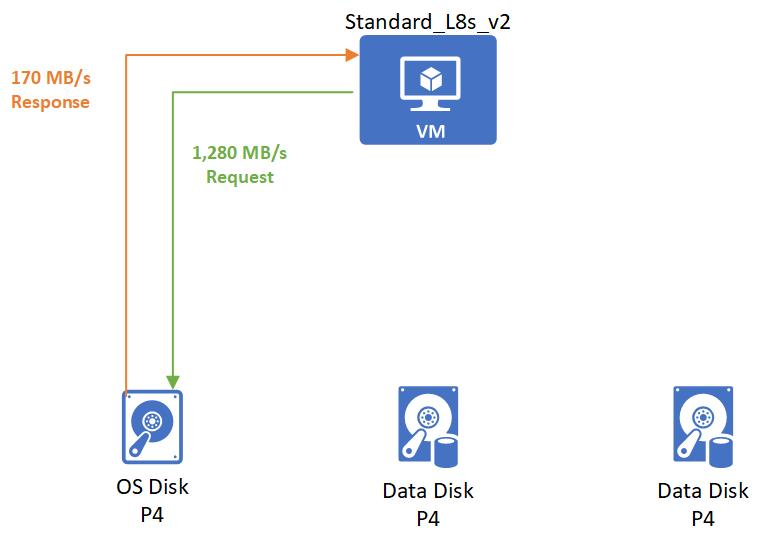
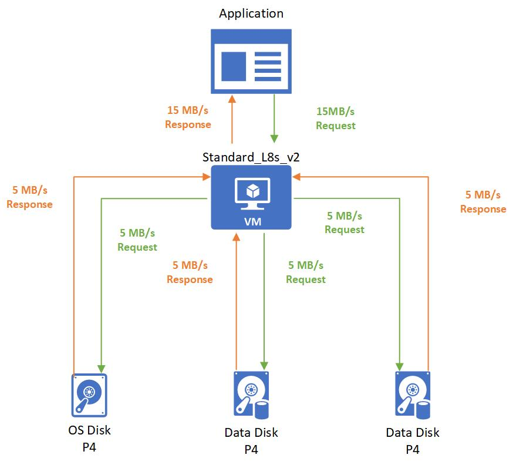
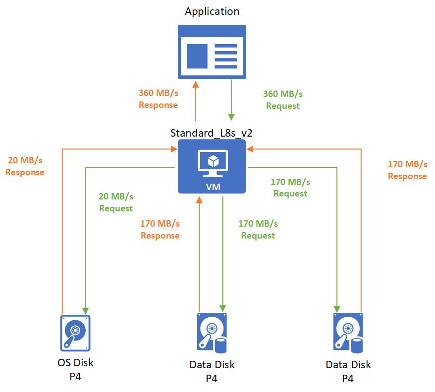

# Managed disk bursting

**Applies to:** :heavy_check_mark: Linux VMs :heavy_check_mark: Windows VMs :heavy_check_mark: Flexible scale sets :heavy_check_mark: Uniform scale sets

Azure disk bursting temporarily increases a managed disk's IOPS and throughput above its provisioned performance targets. Virtual machine (VM) bursting is a separate capability. A burst-capable disk doesn't require a burst-capable VM, and a burst-capable VM doesn't require burst-capable disks.

## Common scenarios
The following scenarios can benefit greatly from bursting:
- **Improve startup times**  – With bursting, your instance starts up faster. For example, the default OS disk for premium enabled VMs is the P4 disk, which is a provisioned performance of up to 120 IOPS and 25 MB/s. With bursting, the P4 can go up to 3,500 IOPS and 170 MB/s, so startup accelerates by up to 6x.
- **Handle batch jobs** – Some application workloads are cyclical in nature. They require a baseline performance most of the time, and higher performance for short periods of time. An example of this nature is an accounting program that processes daily transactions that require a small amount of disk traffic. At the end of the month, this program completes reconciling reports that need a much higher amount of disk traffic.
- **Traffic spikes** – Web servers and their applications can experience traffic surges at any time. If your web server is backed by VMs or disks that use bursting, the servers are better equipped to handle traffic spikes. 

## Disk-level bursting

Currently, two managed disk types support bursting: [Premium SSD managed disks](disks-types.md#premium-ssds) and [Standard SSDs](disks-types.md#standard-ssds). Other disk types don't support bursting. There are two models of bursting for disks:

- An on-demand bursting model, where the disk bursts whenever its needs exceed its current capacity. This model incurs extra charges anytime the disk bursts. On-demand bursting is only available for Premium SSD managed disks larger than 512 GiB.
- A credit-based model, where the disk bursts only if it has burst credits accumulated in its credit bucket. This model doesn't incur extra charges when the disk bursts. Credit-based bursting operates on a best effort basis and isn't guaranteed. Credit-based bursting is only available for Premium SSD managed disks 512 GiB and smaller, and Standard SSDs 1,024 GiB and smaller.

Azure [Premium SSD managed disks](disks-types.md#premium-ssds) can use either bursting model, but [Standard SSDs](disks-types.md#standard-ssds) currently only offer credit-based bursting.

You can also [change the performance tier of managed disks](disks-change-performance.md), which could be ideal if your workload would otherwise be running in burst.

| Attribute | Credit-based bursting | On-demand bursting | Changing the performance tier |
|---|---|---|---|
| **Scenario** | Short-term scaling for 30 minutes or less. | Short-term scaling without a fixed duration. | Workloads that would otherwise run in burst continually. |
| **Cost** | No additional cost. | Variable cost. For details, see [On-demand bursting billing](#on-demand-bursting-billing). | Fixed cost for each tier. For details, see [Managed Disks pricing](https://azure.microsoft.com/pricing/details/managed-disks/). |
| **Availability** | Premium SSD managed disks 512 GiB and smaller, and Standard SSDs 1,024 GiB and smaller. | Premium SSD managed disks larger than 512 GiB. | All Premium SSD managed disk sizes. |
| **Enablement** | Enabled by default on eligible disks. | You must enable it. | You must change the tier manually. |

### On-demand bursting

Premium SSD managed disks that use the on-demand bursting model of disk bursting can burst beyond the original provisioned targets as often as their workload needs, up to the maximum burst target. For example, on a 1-TiB P30 disk, the provisioned IOPS is 5,000 IOPS. When you enable disk bursting on this disk, your workloads can send I/O operations to this disk up to the maximum burst performance of 30,000 IOPS and 1,000 MB/s. For the maximum burst targets on each supported disk, see [Scalability and performance targets for VM disks](/azure/virtual-machines/disks-scalability-targets#premium-ssd-managed-disks-per-disk-limits).

If you expect your workloads to frequently run beyond the provisioned performance target, disk bursting isn't cost-effective. In this case, change your disk's performance tier to a [higher tier](/azure/virtual-machines/disks-performance-tiers) for better baseline performance. Review your billing details and assess that against the traffic pattern of your workloads.

Before you enable on-demand bursting, understand the following:

[!INCLUDE [managed-disk-bursting-regions-limitations](includes/managed-disk-bursting-regions-limitations.md)]

#### On-demand bursting billing

On-demand bursting costs for Premium SSD managed disks have two components. The first is an hourly burst enablement flat fee, which varies by region and applies regardless of attachment state until you disable bursting. The second consists of variable pay-as-you-go charges based on the number of uncached read and write I/O transactions that exceed the provisioned IOPS or throughput target.

##### IOPS-only billing example

This example uses a 1-TiB Premium SSD P30 disk with on-demand bursting enabled and a provisioned target of 5,000 IOPS.

| Time | Disk activity | Burst transactions |
|---|---|---:|
| 00:00:00–00:10:00 | IOPS remain below the provisioned target. | 0 |
| 00:10:01–00:10:10 | A batch job uses 6,000 IOPS for 10 seconds. | `(6,000 - 5,000) × 10 = 10,000` |
| 00:10:11–00:59:00 | IOPS remain below the provisioned target. | 0 |
| 00:59:01–01:00:00 | A batch job uses 7,000 IOPS for 60 seconds. | `(7,000 - 5,000) × 60 = 120,000` |

Disk bursting occurs during two intervals in the billing hour. From 00:10:01 through 00:10:10, the accumulated burst transactions are `(6,000 - 5,000) × 10 = 10,000`. From 00:59:01 through 01:00:00, the accumulated burst transactions are `(7,000 - 5,000) × 60 = 120,000`.

Together, the two intervals produce 130,000 burst transactions, which Azure bills as 13 units of 10,000 transactions. At the applicable regional transaction rate, those 13 units cost $Y. The total cost for the billing hour is the regional hourly burst enablement flat fee of $X plus the burst transaction cost of $Y. The flat fee applies regardless of the disk's attachment state until you disable on-demand bursting.

##### Combined IOPS and throughput billing example

This example uses a 1-TiB Premium SSD P30 disk with on-demand bursting enabled and provisioned targets of 5,000 IOPS and 200 MB/s. Azure converts throughput above the provisioned target to transactions by using an I/O size of 256 KB. When both IOPS and throughput exceed their targets, Azure uses the larger transaction count.

| Time | Disk activity | IOPS burst transactions | Throughput burst transactions | Billable burst transactions |
|---|---|---:|---:|---:|
| 00:00:01–00:00:05 | A batch job uses 10,000 IOPS and 300 MB/s for five seconds. | `(10,000 - 5,000) × 5 = 25,000` | `(300 - 200) × 1,024 ÷ 256 × 5 = 2,000` | 25,000 |
| 00:00:06–00:00:10 | A recovery job uses 6,000 IOPS and 600 MB/s for five seconds. | `(6,000 - 5,000) × 5 = 5,000` | `(600 - 200) × 1,024 ÷ 256 × 5 = 8,000` | 8,000 |

Azure calculates accumulated burst transactions by using the maximum number of transactions from either the IOPS or throughput bursting. From 00:00:01 through 00:00:05, the accumulated burst transactions are `Max((10,000 - 5,000), ((300 - 200) × 1,024 ÷ 256)) × 5 = 25,000`. From 00:00:06 through 00:00:10, the accumulated burst transactions are `Max((6,000 - 5,000), ((600 - 200) × 1,024 ÷ 256)) × 5 = 8,000`.

Apply the regional transaction rate to the billable transactions, then add the hourly burst enablement flat fee to calculate the total cost of on-demand disk bursting.

For details on pricing, see the [managed disks pricing page](https://azure.microsoft.com/pricing/details/managed-disks/). Use the [Azure Pricing Calculator](https://azure.microsoft.com/pricing/calculator/?service=storage) to make the assessment for your workload. 

To enable on-demand bursting, see [Enable on-demand bursting](/azure/virtual-machines/disks-enable-bursting).

### Credit-based bursting

For Premium SSD managed disks, credit-based bursting is available for disk sizes P20 and smaller. For Standard SSDs, credit-based bursting is available for disk sizes E30 and smaller. For both Standard SSDs and Premium SSD managed disks, credit-based bursting is available in all regions in Azure Public, Government, and China Clouds. By default, disk bursting is enabled on all new and existing deployments of supported disk sizes. VM-level bursting only uses credit-based bursting.

## Virtual machine-level bursting

VM-level bursting only uses the credit-based model for bursting. It's enabled by default for most VMs that support Premium Storage.

## Bursting flow

The bursting credit system applies in the same manner at both the VM level and disk level. Your resource, either a VM or disk, starts with fully stocked credits in its own burst bucket. These credits allow you to burst for up to 30 minutes at the maximum burst rate. You accumulate credits whenever the resource's IOPS or MB/s are below the resource's performance target. If your resource accrues bursting credits and your workload needs extra performance, your resource can use those credits to go above its performance limits on a best-effort basis to help meet workload demands.

How you spend your available credits is up to you. You can use your 30 minutes of burst credits consecutively or sporadically throughout the day. When you deploy resources, they come with a full allocation of credits. When those credits deplete, it takes less than a day to restock. You can spend credits at your discretion. The burst bucket doesn't need to be full in order for resources to burst. Burst accumulation varies depending on each resource, since it's based on unused IOPS and MB/s below their performance targets. Higher baseline performance resources accrue their bursting credits faster than lower baseline performing resources. For example, a P1 disk idling accrues 120 IOPS per second, whereas an idling P20 disk accrues 2,300 IOPS per second.

## Bursting states
There are three states your resource can be in with bursting enabled:
- **Accruing** – The resource's I/O traffic uses less than the performance target. IOPS and MB/s burst credits accumulate separately. Your resource can accrue IOPS credits while spending MB/s credits, or vice versa.
- **Bursting** – The resource's traffic uses more than the performance target. The burst traffic independently consumes IOPS or throughput credits.
- **Constant** – The resource's traffic is exactly at the performance target.

## Bursting examples

The following examples show how bursting works with various VM and disk combinations. To make the examples easy to follow, they focus on MB/s, but the same logic is applied independently to IOPS.

### Burstable virtual machine with nonburstable disks
**VM and disk combination:** 
- Standard_L8s_v2 
    - Uncached MB/s: 160
    - Max burst MB/s: 1,280
- P50 OS Disk
    - Provisioned MB/s: 250 
    - On-demand bursting: **not enabled**
- 2 P50 Data Disks 
    - Provisioned MB/s: 250
    - On-demand bursting: **not enabled**

After startup, an application runs a noncritical workload on the VM. The workload requires 30 MB/s, which is distributed evenly across the disks.

Then the application needs to process a batched job that requires 600 MB/s. The Standard_L8s_v2 bursts to meet this demand and then requests to the disks get evenly spread out to P50 disks.

### Burstable virtual machine with burstable disks
**VM and disk combination:** 
- Standard_L8s_v2 
    - Uncached MB/s: 160
    - Max burst MB/s: 1,280
- P4 OS Disk
    - Provisioned MB/s: 25
    - Max burst MB/s: 170 
- 2 P4 Data Disks 
    - Provisioned MB/s: 25
    - Max burst MB/s: 170 

When the VM starts, it bursts to request its burst limit of 1,280 MB/s from the OS disk, and the OS disk responds with its burst performance of 170 MB/s.

After startup, you start an application that has a noncritical workload. This application requires 15 MB/s that gets spread evenly across all the disks.

Then the application processes a batch job that requires 360 MB/s. The Standard_L8s_v2 VM bursts to meet this demand. The OS disk supplies 20 MB/s, and the two bursting P4 data disks supply the remaining 340 MB/s.

## Next steps

- To enable on-demand bursting, see [Enable on-demand bursting](disks-enable-bursting.md).
- To learn how to gain insight into your bursting resources, see [Disk bursting metrics](disks-metrics.md).
- To see exactly how much each applicable disk size can burst, see [Scalability and performance targets for VM disks](disks-scalability-targets.md).

