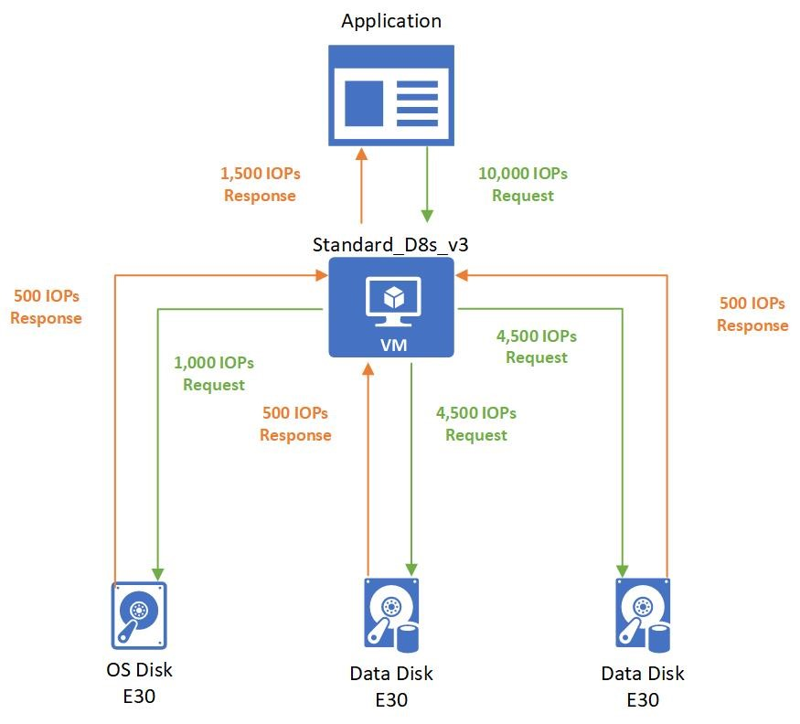
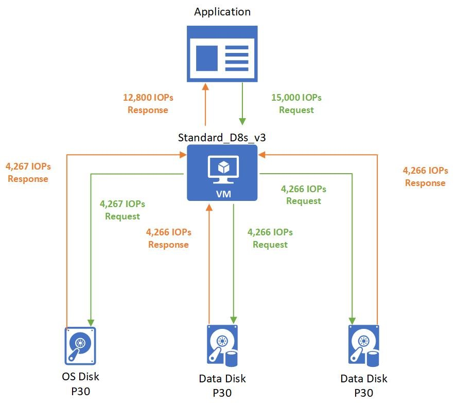
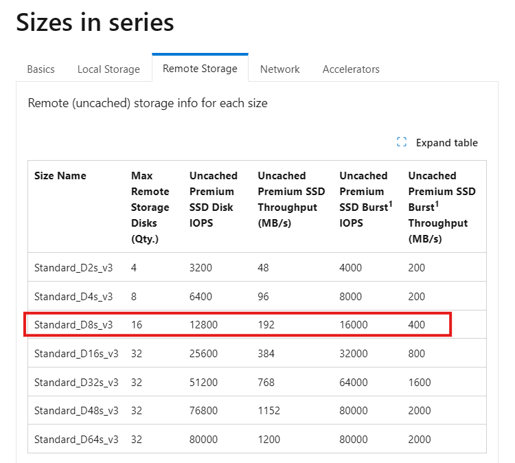
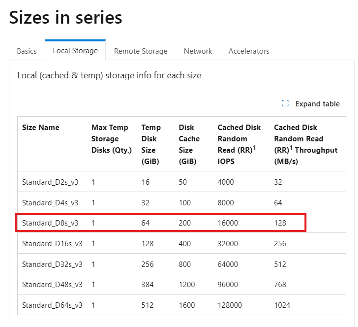
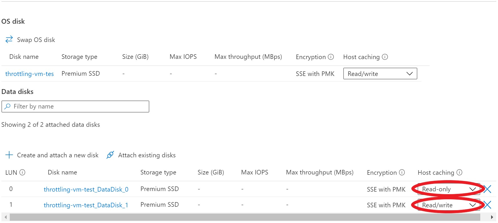
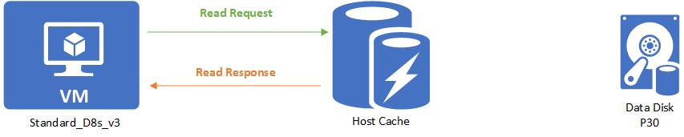
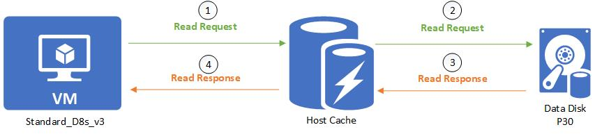
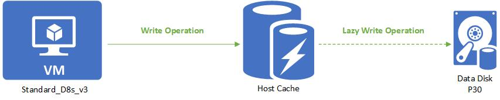
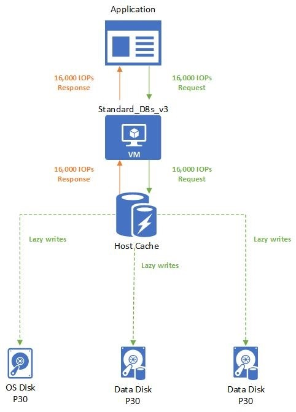
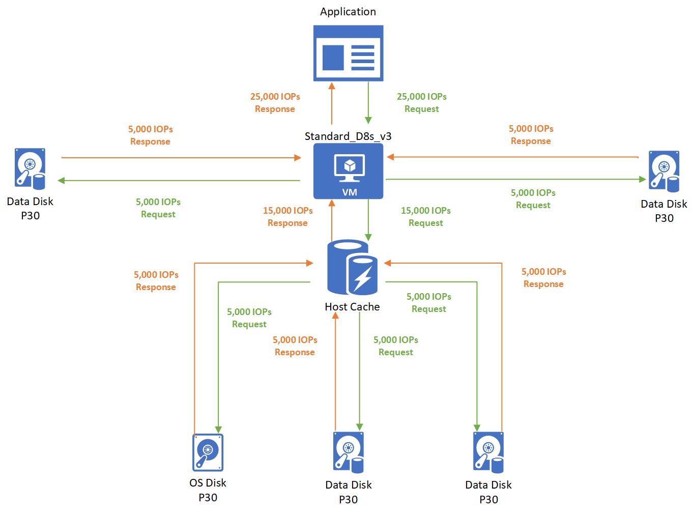

# Virtual machine and disk performance

**Applies to:** :heavy_check_mark: Linux VMs :heavy_check_mark: Windows VMs :heavy_check_mark: Flexible scale sets :heavy_check_mark: Uniform scale sets

This article explains how Azure Virtual Machines (VMs) and managed disk performance limits interact. It also describes how to diagnose disk I/O bottlenecks and optimize storage performance.

## How Azure VM and managed disk performance limits interact

Azure VMs have input/output operations per second (IOPS) and throughput limits based on the VM type and size. Managed OS disks and data disks have their own IOPS and throughput limits.

## Disk allocation and performance

Disks attached to an Azure VM use three I/O paths. The following diagram shows how Azure allocates bandwidth and input/output operations per second (IOPS) across those paths in real time.

:::image type="content" source="media/disks-performance/real-time-disk-allocation.png" alt-text="Diagram of uncached managed disk I/O passing through disk and VM network limits. Cached I/O also uses SSD limits, while cache hits and temporary disk I/O use the server SSD." lightbox="media/disks-performance/real-time-disk-allocation.png":::

The first I/O path is the uncached managed disk path. I/O operations use this path when you're using a managed disk and you set the host caching to `none`. I/O operations that use this path run based on disk-level provisioning and then VM network-level provisioning for IOPS and throughput.

The second I/O path is the cached managed disk path. Cached managed disk I/O uses an SSD that's close to the VM. This SSD has its own IOPS and throughput provisioned, and it appears as "SSD-level provisioning" in the diagram.

When a cached managed disk initiates a read, the request first checks to see if the data is in the server SSD. If the data isn't present, a cached miss occurs. Then the I/O runs based on SSD-level provisioning, disk-level provisioning, and then VM network-level provisioning for IOPS and throughput.

When the server SSD initiates reads on cached I/O that are present on the server SSD, a cache hit occurs. The I/O then runs based on the SSD-level provisioning. Writes that a cached managed disk initiates always follow the path of a cached miss. They go through SSD-level, disk-level, and VM network-level provisioning.

The third path is for the [temporary disk](managed-disks-overview.md#temporary-disk). It's available only on VMs that support temporary disks. An I/O operation that uses this path runs based on SSD-level provisioning for IOPS and throughput.

The following diagram depicts an example of these limitations. The system prevents a Standard_D2s_v3 VM from achieving the 5,000 IOPS potential of a P30 disk, whether it's cached or not, because of limits at the SSD and network levels.

:::image type="content" source="media/disks-performance/example-vm-allocation.png" alt-text="Diagram of a Standard_D2s_v3 VM limiting P30 disk performance to 3,200 IOPS and 32 MBps for uncached I/O or 4,000 IOPS and 32 MBps for cached I/O." lightbox="media/disks-performance/example-vm-allocation.png":::

Azure uses a prioritized network channel for disk traffic. Disk traffic takes precedence over low-priority network traffic. This prioritization helps disks maintain their expected performance if there's network contention.

Similarly, Azure Storage handles resource contentions and other issues in the background with automatic load balancing. Azure Storage allocates required resources when you create a disk, and it applies proactive and reactive balancing of resources to handle the traffic level. This behavior further ensures that disks can sustain their expected IOPS and throughput targets. Use VM-level and disk-level [metrics](disks-metrics.md) to track the performance and set up alerts as needed.

## Disk I/O capping

Your application's performance gets capped when it requests more IOPS or throughput than what is allotted for the virtual machines or attached disks. When capped, the application experiences suboptimal performance. This condition can lead to negative consequences like increased latency. The following examples use IOPS, but the same logic applies to throughput.

**Disk-level capping example setup:**

- Standard_D8s_v3
  - Uncached IOPS: 12,800
- E30 OS disk
  - IOPS: 500
- Two E30 data disks × 2
  - IOPS: 500

The application running on the virtual machine makes a request that requires 10,000 IOPS to the virtual machine. All of which are allowed by the VM because the Standard_D8s_v3 virtual machine can execute up to 12,800 IOPS.

The 10,000 IOPS requests are broken down into three different requests to the different disks:

- 1,000 IOPS are requested to the operating system disk.
- 4,500 IOPS are requested to each data disk.

All attached disks are E30 disks and can only handle 500 IOPS. So, they respond back with 500 IOPS each. The application's performance is capped by the attached disks, and it can only process 1,500 IOPS. The application could work at peak performance at 10,000 IOPS if better-performing disks are used, such as Premium SSD P30 disks.

## Virtual machine I/O capping

**VM-level capping example setup:**

- Standard_D8s_v3
  - Uncached IOPS: 12,800
- P30 OS disk
  - IOPS: 5,000
- Two P30 data disks × 2
  - IOPS: 5,000

The application running on the virtual machine makes a request that requires 15,000 IOPS. Unfortunately, the Standard_D8s_v3 virtual machine is only provisioned to handle 12,800 IOPS. The application is capped by the virtual machine limits and must allocate the allotted 12,800 IOPS.

Those 12,800 IOPS requested are broken down into three different requests to the different disks:

- 4,267 IOPS are requested to the operating system disk.
- 4,266 IOPS are requested to each data disk.

All attached disks are P30 disks that can handle 5,000 IOPS. So, they respond back with their requested amounts.

## Virtual machine cached and uncached limits

Virtual machines that are enabled for both premium storage and premium storage caching have two different storage bandwidth limits. Let's look at the Standard_D8s_v3 virtual machine as an example. Here is the documentation on the [Dsv3-series](./sizes/general-purpose/dsv3-series.md) and the Standard_D8s_v3:

- The "*Uncached*" disk data under the **Remote Storage** are the default storage maximum limits that the virtual machine can handle.
  

- The "*Cached*" disk data under the **Local Storage** tab are separate limits when you enable host caching.
  

### Configure host caching

Host caching works by bringing storage closer to the VM that can be written or read to quickly. The amount of storage that is available to the VM for host caching is in the documentation. For example, you can see the Standard_D8s_v3 comes with 200 GiB of cache storage.

You can enable host caching when you create your virtual machine and attach disks. You can also turn on and off host caching on your disks on an existing VM. By default, cache-capable data disks do not have caching enabled. Cache-capable OS disks have read/write caching enabled.

You can adjust the host caching to match your workload requirements for each disk. You can set your host caching to be:

- **Read-only**: For workloads that only do read operations
- **Read/write**: For workloads that do a balance of read and write operations

If your workload doesn't follow either of these patterns, we don't recommend that you use host caching.

### Read-only host caching

The following example shows how I/O requests flow when you set host caching to **Read-only**.

**Read-only host caching example setup:**

- Standard_D8s_v3
  - Cached IOPS: 16,000
  - Uncached IOPS: 12,800
- P30 data disk
  - IOPS: 5,000
  - Host caching: **Read-only**

When a read is performed and the desired data is available on the cache, the cache returns the requested data. There's no need to read from the disk. This read is counted toward the VM's cached limits.

When a read is performed and the desired data *isn't* available on the cache, the read request is relayed to the disk. Then the disk surfaces it to both the cache and the VM. This read is counted toward both the VM's uncached limit and the VM's cached limit.

When a write is performed, the write has to be written to both the cache and the disk before it's considered complete. This write is counted toward the VM's uncached limit and the VM's cached limit.

### Read/write host caching

The following example shows how I/O requests flow when you set host caching to **Read/write**.

**Read/write host caching example setup:**

- Standard_D8s_v3
  - Cached IOPS: 16,000
  - Uncached IOPS: 12,800
- P30 data disk
  - IOPS: 5,000
  - Host caching: **Read/write**

With read/write host caching, cache-hit reads count toward the VM's cached limits. Cache-miss reads count toward both the VM's cached and uncached limits. Writes are handled differently: A write needs to reach only the host cache to be considered complete. The write is then lazily written to the disk when the cache is flushed periodically. You can also force a flush by issuing an `f/sync` or `fua` command. A write counts toward cached I/O when it's written to the cache and toward uncached I/O when it's lazily written to the disk.

### Cached-limit example

The following example uses a Standard_D8s_v3 VM with host caching enabled and three attached P30 disks. The VM has a cached limit of 16,000 IOPS, and each P30 disk can handle 5,000 IOPS.

**Cached-limit example setup:**

- Standard_D8s_v3
  - Cached IOPS: 16,000
  - Uncached IOPS: 12,800
- P30 OS disk
  - IOPS: 5,000
  - Host caching: **Read/write**
- Two P30 data disks × 2
  - IOPS: 5,000
  - Host caching: **Read/write**

The application uses a Standard_D8s_v3 virtual machine with caching enabled. It makes a request for 16,000 IOPS. The requests are completed as soon as they're read or written to the cache. Writes are then lazily written to the attached Disks.

## Combined uncached and cached limits

A virtual machine's cached limits are separate from its uncached limits. This separation means you can enable host caching on some disks attached to a VM while not enabling host caching on other disks. This configuration allows your virtual machines to get a total storage I/O of the cached limit plus the uncached limit.

The following example shows how cached and uncached limits work together on a Standard_D8s_v3 VM with attached Premium SSDs.

**Combined cached and uncached limit example setup:**

- Standard_D8s_v3
  - Cached IOPS: 16,000
  - Uncached IOPS: 12,800
- P30 OS disk
  - IOPS: 5,000
  - Host caching: **Read/write**
- Two P30 data disks × 2
  - IOPS: 5,000
  - Host caching: **Read/write**
- Two P30 data disks × 2
  - IOPS: 5,000
  - Host caching: **Disabled**

In this case, the application running on a Standard_D8s_v3 virtual machine makes a request for 25,000 IOPS. The request is broken down as 5,000 IOPS to each of the attached disks. Three disks use host caching and two disks don't use host caching.

- Since the three disks that use host caching are within the cached limits of 16,000, those requests are successfully completed. No storage performance capping occurs.
- Since the two disks that don't use host caching are within the uncached limits of 12,800, those requests are also successfully completed. No capping occurs.