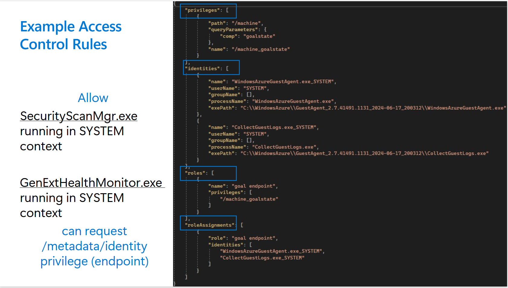

# Converting audit logs to an allowlist

See [Advanced Configuration](../advanced-configuration.md) first to learn about Role Based Access Control (RBAC) and the `InVMAccessControlProfile` resource type in Metadata Security Protocol (MSP).

## Collecting Audit Logs

If MSP is enabled in `Audit` or `Enforce` mode, the GPA creates audit logs in the Virtual Machine (VM).

| OS Family | Audit Log Location |
|--|--|
| Linux | `/var/lib/azure-proxy-agent/ProxyAgent.Connection.log` |
| Windows | `C:\WindowsAzure\ProxyAgent\Logs\ProxyAgent.Connection.log` |

## Converting Logs to Rules

There are two ways to create an Allowlist:
- Automated Allowlist generation
- Manually create Allowlist

## Structure of an Allowlist 
An allow list is comprised of privileges, identities, roles, and role assignments. 
   - Identities are processes on the machine.
   - Privileges are endpoints being accessed by identities. 
   - Roles is a grouping of privileges.
   - Role Assignments consists of a role and the list of identities granted access for that role.

### Automated Allowlist generation

1. Download and run the Allowlist Tool:
   - Navigate to Assests in the Release Notes and click on `allowListTool.exe` from the [latest release page](https://github.com/Azure/GuestProxyAgent/releases/latest)
1. To build your allow list, launch the exe provided above. The tool will parse the ProxyAgentConnection logs and display the current privileges and identities on the VM. Then create roles and role assignments: 
   - To create a Role, select a grouping of privileges and give the role a descriptive name.
   - To create a Role Assignment, select a role and a grouping of identities, these identities will be able to access the privileges grouped in that role. Give the role assignment a descriptive name.

### Manually create Allowlist

Once a VM is enabled with MSP in Audit/Enforce mode, the proxy agent would capture all the requests being made to the Host endpoints. The logs are captured in the folder inside the VM:

| Operating System | Log File Path |
|--|--|
| Windows | `C:\WindowsAzure\ProxyAgent\Logs\ProxyAgent.Connection.log` |
| Linux | `/var/lib/azure-proxy-agent/ProxyAgent.Connection.log` |

From the connection logs, you can analyze the applications that are making the requests to the Instance Metadata Service(IMDS)/WireServer endpoints:

[](../images/create-shared-image-gallery/status-log.png#lightbox)

The JSON captured here would be of the format:

[](../images/create-shared-image-gallery/parse-json-from-logs.png#lightbox)

From the log file, you can identify the endpoints that you want to secure (which would be the `privileges` in the final `InVMAccessControlProfile`), and the `identities` that should have access.

A simple rules schema would look like:

[](../images/create-shared-image-gallery/example-access-control-rules.png#lightbox)

> [!NOTE]
> We built an allowlist generator tool to make it easier to generate the Access Control rules. The allowlist tool helps parse the audit logs & provide a UI to generate the Access control roles.

## Creating a New `InVMAccessControlProfile`

### Using ARM template

1. [Create a new private gallery](/azure/virtual-machines/create-gallery) in Azure compute gallery.
1. Create an `InVMAccessControlProfile` definition with parameters for:
    - The gallery name to store in (from step 1)
    - Profile name
    - OS type
    - Host Endpoint type (Wireserver or IMDS)
1. Create a specific version

## Sample InVMAccessControlProfile

```
"properties": {
    "mode": "Enforce",
    "defaultAccess": "Allow",
    "rules": {
      "privileges": [
        {
          "name": "GoalState",
          "path": "/machine",
          "queryParameters": {
            "comp": "goalstate"
          }
        }
      ],
      "roles": [
        {
          "name": "Provisioning",
          "privileges": [
            "GoalState"
          ]
        },
        {
          "name": "ManageGuestExtensions",
          "privileges": [
            "GoalState"
          ]
        },
        {
          "name": "MonitoringAndSecret",
          "privileges": [
            "GoalState"
          ]
        }
      ],
      "identities": [
        {
          "name": "WinPA",
          "userName": "SYSTEM",
          "exePath": "C:\\Windows\\System32\\cscript.exe"
        },
        {
          "name": "GuestAgent",
          "userName": "SYSTEM",
          "processName": "WindowsAzureGuestAgent.exe"
        },
        {
          "name": "WaAppAgent",
          "userName": "SYSTEM",
          "processName": "WaAppAgent.exe"
        },
        {
          "name": "CollectGuestLogs",
          "userName": "SYSTEM",
          "processName": "CollectGuestLogs.exe"
        },
        {
          "name": "AzureProfileExtension",
          "userName": "SYSTEM",
          "processName": "AzureProfileExtension.exe"
        },
        {
          "name": "AzurePerfCollectorExtension",
          "userName": "SYSTEM",
          "processName": "AzurePerfCollectorExtension.exe"
        },
        {
          "name": "WaSecAgentProv",
          "userName": "SYSTEM",
          "processName": "WaSecAgentProv.exe"
        }
      ],
      "roleAssignments": [
        {
          "role": "Provisioning",
          "identities": [
            "WinPA"
          ]
        },
        {
          "role": "ManageGuestExtensions",
          "identities": [
            "GuestAgent",
            "WaAppAgent",
            "CollectGuestLogs"
          ]
        },
        {
          "role": "MonitoringAndSecret",
          "identities": [
            "AzureProfileExtension",
            "AzurePerfCollectorExtension",
            "WaSecAgentProv"
          ]
        }
      ]
    },
```
