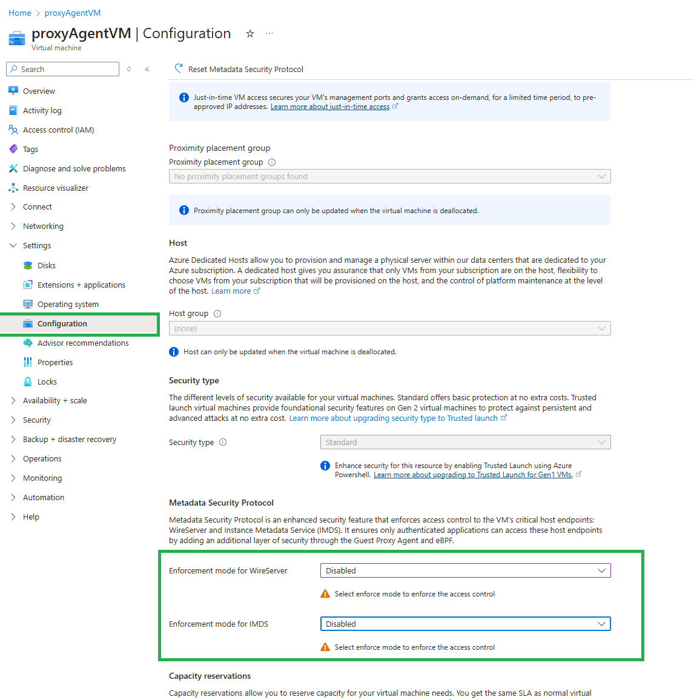

# Disable MSP

You can disable Metadata Security Protocol (MSP) by using the REST API and (partially) the Azure portal.

## REST API

Set the `securityProfile.proxyAgentSettings.enabled` to `false`:

```http
PATCH https://management.azure.com/subscriptions/{subscription-id}/resourceGroups/{resource-group-name}/providers/Microsoft.Compute/virtualMachines/{virtualMachine-Name}?api-version=2024-03-01
{
  "properties": {
    "securityProfile": {
      "proxyAgentSettings": {
        "enabled": false,
      }
    },
  }
}
```

## Azure portal

The portal doesn't allow disabling MSP completely at this time. But you can disable enforcement of security requirements to allow requests to flow normally.

Go to your virtual machine, and then go to **Settings** > **Configuration**. In the **Metadata Security Protocol** area, in the boxes for enforcement mode, select **Disabled**.


