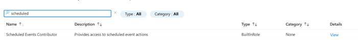
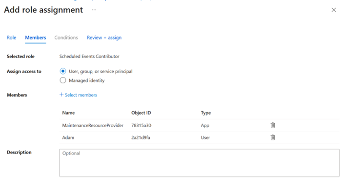

# Scheduled Events in Azure Resource Graph

> [!Note] 
> Scheduled Events in Azure Resource Graph is in preview.
> See the [Preview Terms Of Use | Microsoft Azure](https://azure.microsoft.com/support/legal/preview-supplemental-terms/) for legal terms that apply to Azure features that are in beta, preview, or otherwise not yet released into general availability.

Scheduled events can be delivered to Azure Resource Graph (ARG) so you can query and understand events from all your virtual machines at scale.

Azure Resource Graph lets developers explore Azure resources and their properties across subscriptions at scale. It supports complex querying and analysis, providing a comprehensive view of resources and their relationships. The `maintenanceresources` table includes all scheduled events, such as reboot, redeploy, or reimage. By querying this table, you can understand patterns about past scheduled events, root cause outages, and create reports about past interruptions.

## Prerequisites

Before you begin, familiarize yourself with these topics:

- [Scheduled events overview](scheduled-events-overview.md)
- [Overview of Azure Resource Graph](https://learn.microsoft.com/azure/governance/resource-graph/overview)

## Using Resource Graph with Scheduled Events

Azure Resource Graph is most helpful when you want to do large-scale queries about events across the history of all the VMs in your subscription or for its integration with other tools. For example, if you're trying to understand if there were any interruptions to your workload over the last week then you can create a query that shows all the scheduled events that impacted your VMs and sort them by the estimated duration of the impact.

This section shows you how to enable event delivery and receive your first scheduled events.

### Accessing Scheduled Events in Azure Resource Graph Preview
During the preview, you need to explicitly enable access to event delivery to Azure Resource Graph via a feature flag. During the preview we don't recommend using this delivery method for production workloads. 

```azurecli
az feature register --name SendScheduledEventsPolicy --namespace Microsoft.Compute
```

### Opting-In to Scheduled Events in Azure Resource Graph

By default, scheduled events aren't delivered to Azure Resource Graph for virtual machines on Azure. If you wish to receive scheduled events you need to opt in using either the VM profile, the Virtual Machine Scale Set profile, or the availability set profile. If your VM is part of an availability set or a Virtual Machine Scale Set then you can't set the schedule events profile for each VM individually. All VMs in the same Virtual Machine Scale Set or availability set are required to have the same scheduled events policy.

Enabling delivery to the Event Grid System Topic also delivers the events to the [Event Grid System Topic](scheduled-events-event-grid.md).

If you're using Virtual Machine Scale Sets Flex or Uniform, enable scheduled events in Event Grid using the `scheduledEventsAdditionalPublishingTargets` [eventGridAndResourceGraph](https://learn.microsoft.com/rest/api/compute/virtual-machine-scale-sets/create-or-update?view=rest-compute-2025-11-01&tabs=HTTP) setting. This setting enables scheduled events for all VMs in the scale set and ensure they're published to both Event Grid and the Azure Resource Graph.

```json
"scheduledEventsPolicy": {
      "scheduledEventsAdditionalPublishingTargets": {
        "eventGridAndResourceGraph": {
          "enable": true
        }
      },
      "userInitiatedRedeploy": {
        "automaticallyApprove": true
      },
      "userInitiatedReboot": {
        "automaticallyApprove": true
      }
    }
```

You can also enable scheduled events using the Azure CLI for new and Virtual Machine Scale Sets.

```azurecli
az vmss create  --name "<ScaleSetName>" -g "<ResourceGroupName>"  -platformFaultDomainCount <DesiredFaultDomainCount> --set scheduledEventsPolicy='{
    "scheduledEventsAdditionalPublishingTargets": {
      "eventGridAndResourceGraph": {
        "enable": true,
        "scheduledEventsApiVersion": "2020-07-01"
      }
    }
  }'
```

You can enable scheduled events for an existing Virtual Machine Scale Set at any time using the Azure CLI or by directly modifying the Virtual Machine Scale Set profile.

```azurecli

az vmss update --resource-group "vm_group" --name "SETest" --set scheduledEventsPolicy='{
    "scheduledEventsAdditionalPublishingTargets": {
      "eventGridAndResourceGraph": {
        "enable": true,
        "scheduledEventsApiVersion": "2020-07-01"
      }
    }
  }'

```

We recommend that you set this property when you create the scale set to ensure that scheduled events are always enabled for every virtual machine.

### Role Based Access Control to View Scheduled Events

A user must have the `ScheduledEventContributor` role to read or acknowledge the scheduled events from a VM.

1. Navigate to the Access Control (IAM) tab of a subscription / Resource Group / Resource.
2. Select  Add and choose Add role assignment.
3. Search for ScheduledEventContributor 

4. Select appropriate members to provision this role and assign it to Service identifier 78315a30-673a-4a46-8e5c-ce59dbc6adf8 (MaintenanceResourceProvider)


### Querying Azure Resource Graph to View VM Events

Scheduled events are written to the `maintenanceresources` table with type `microsoft.maintenance/scheduledevents`. Every time a scheduled event changes state it creates an update its entry in the table with the same information as would be available in Event Grid or the IMDS endpoint.

You can access Azure Resource Graph through the Azure portal by searching for Resource Graph Explorer. There's a basic query interface available in the portal for simple queries, and for more [advanced queries you can use either Azure CLI or Azure PowerShell](https://learn.microsoft.com/azure/governance/resource-graph/samples/advanced?tabs=azure-cli).

The following ARG query returns all the scheduled events for virtual machines in your subscriptions

```kusto

maintenanceresources
| where type == "microsoft.maintenance/scheduledevents"

```

The properties field contains the scheduled events specific information. You can split this information into its own columns using the `project` function.

```kusto

Maintenanceresources
| where type == "microsoft.maintenance/scheduledevents"
| sort by tostring(properties.EventStatus), tostring(properties.EventId) asc
| project resourceGroup, zones, properties.EventStatus, properties.NotBefore, properties.Resources, properties.EventId, properties.TargetResourceId, properties.EventType, properties.Description

```
## Detailed Schemas for Scheduled Events in Azure Resource Graph

The events that are delivered to Azure Resource Graph have a standard Azure Resource Graph wrapper, with the scheduled events specific information in the payload field. This section covers all the fields in payload along with a sample payload from a scheduled event.

### Azure Resource Graph Payload Fields

These values are standard to the `maintenanceresources` table and mostly include metadata about the scheduled event or maintenance operation.

| Field | Description |
| --- | --- |
| ID | The Azure Resource Manager (ARM) ID of the scheduled event. The final GUID is the same as the event ID in scheduled event specific fields and as the event in the VM. `/subscriptions/{subscription-id}/resourcegroups/{rg-name}/providers/Microsoft.Compute/virtualmachineschalsets/{vmss-name}/providers/Microsoft.Maintenance/Scheduledevents/{event-id}` |
| Name | This field contains the Event ID, which is a unique identifier for the event. The EventId won't change as the EventStatus changes throughout the event's lifetime |
| Type | For scheduled events it is always `microsoft.maintenance/scheduledevents` |
| TenantID | ID for your Azure tenant |
| Location | Region that the impacted resources are in. |
| Resource Group | Resource group of the VMs the scheduled event impacts. |
| Subscription ID | The subscription ID of the impacted resources |
| Properties | JSON payload of the scheduled events specific fields. |
| Zones | Availability zone of the impacted resources | 


### Scheduled Events Specific Fields

These fields contain the same information as the IMDS and Event Grid System Topic, except for the EventStatus field.

| Field | Description |
| --------------- | ------------- |
| EventId | A unique identifier for an event. The EventId doesn't change as the EventStatus changes throughout the event's lifetime |
| EventType | Impact this event causes. <br>**Freeze:** The Virtual Machine is scheduled to pause for a few seconds. CPU and network connectivity might be suspended, but there's no impact on memory or open files.<br><br>**Reboot:** The Virtual Machine is scheduled for reboot (non-persistent memory is lost). In rare cases a VM scheduled for EventType:"Reboot" might experience a freeze event instead of a reboot. <br><br>**Redeploy:** The Virtual Machine is scheduled to move to another node (ephemeral disks are lost).<br><br>**Preempt:** The Spot Virtual Machine is being deleted (ephemeral disks are lost). This event is made available on a best effort basis.<br><br>**Terminate:** The virtual machine is scheduled for deletion. |
| ResourceType | Type of resource this event affects. Currently the only possible value is `"VirtualMachine"` |
| Resources | Array of resources this event affects, identified by VM instance names. Approving this event approves it to proceed for all resources listed in this array. |
| EventStatus | Status of this event. <br>**Scheduled:** The event is scheduled to start after the time specified in the NotBefore property.<br><br>**Started:** The event has started.<br><br>**Completed:** (Event Grid and ARG only) The event was completed successfully after the maintenance operations was performed.<br><br>**Canceled:** (Event Grid and ARG only) The scheduled impact won't proceed as scheduled and the VM won't be impacted at the scheduled time. |
| NotBefore | Time after which this event can start. The event is guaranteed to not start before this time. Is blank if the event is in the started state. Time is in GMT format, using RFC 1123. |
| Description | A human-readable description of the event. |
| EventSource | Initiator of the event. <br>**Platform:** The Azure platform initiated this event.<br><br>**User:** An authorized user initiated the event. |

## Acknowledging with the Maintenance Resource Provider Endpoint

Once your workload is prepared for an event, it's recommended to acknowledge the event so Azure knows that it's safe to proceed. If an event isn't acknowledged, it will proceed after the NotBefore time indicated in the scheduled event payload.

The acknowledgment API is available through [Azure CLI](https://learn.microsoft.com/cli/azure/maintenance/scheduledevent?view=azure-cli-latest) or events can also be acknowledged using the IMDS endpoint. 

```azurecli

az maintenance scheduledevent acknowledge --resource-group {resourceGroupName} --resource-type "virtualMachines" --resource-name {VMname} --scheduled-event-id {scheduledEventId} --subscription {subscriptionId}

az maintenance scheduledevent acknowledge --ids /subscriptions/{subscriptionId}/resourcegroups/{resourceGroupName}/providers/microsoft.compute/virtualMachines/{resourceName}/providers/microsoft.maintenance/scheduledevents/{scheduledEventId}

```

## Related content
- [Scheduled Events Overview](scheduled-events-overview.md)
- [Scheduled Events Using Event Grid System Topics](scheduled-events-event-grid.md)
- [Scheduled Events Using IMDS on Windows](windows/scheduled-events.md)
- [Scheduled Events Using IMDS on Linux](linux/scheduled-events.md)

