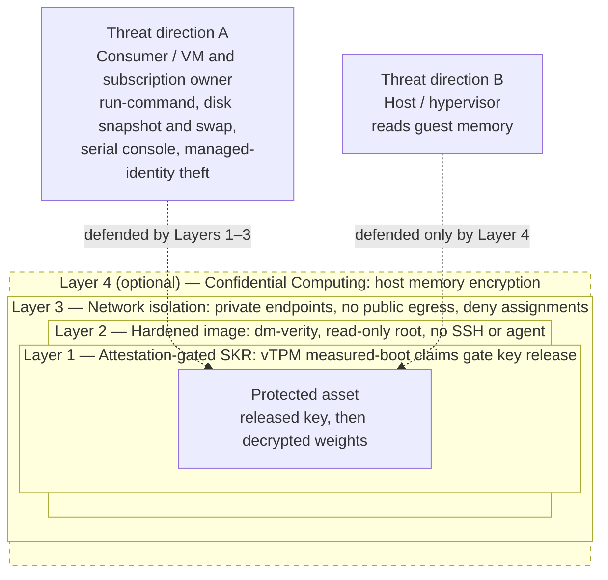
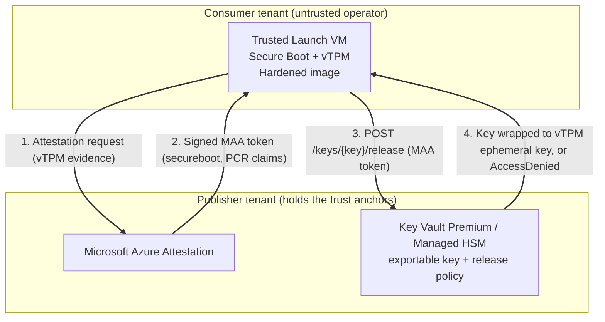

# Protect intellectual property on Azure VMs with attestation-gated Secure Key Release

This article describes a reusable pattern for protecting a sensitive asset—for example, proprietary machine-learning model weights, a licensed dataset, or a secret configuration—that must run on a virtual machine (VM) inside *someone else's* Azure subscription. The party that owns the asset (the **publisher**) is different from the party that owns the subscription where the VM runs (the **consumer**). The consumer has full Azure control-plane access to that VM, yet must not be able to extract the asset.

The pattern combines several documented Azure features into layers of defense. Its cryptographic core is **attestation-gated Secure Key Release (SKR)** from Azure Key Vault, gated on **Trusted Launch** vTPM attestation. It does **not** require Confidential Computing, though Confidential Computing can be added as an optional layer when the threat model demands it.

> [!NOTE]
> Secure Key Release is a data-plane feature of Azure Key Vault Premium and Managed HSM. It validates a signed Microsoft Azure Attestation (MAA) token against a key's release policy, independent of the compute type. Confidential VMs are a common source of these tokens, but they aren't required—Trusted Launch VMs produce MAA tokens too. For the token requirements, see [Azure Key Vault secure key release policy grammar](/azure/key-vault/keys/policy-grammar).

## Scenario and threat model

A publisher distributes a VM-based workload into a consumer's subscription (for example, through Azure Marketplace as a solution template, or as a shared image). The workload needs a decryption key to unlock the publisher's asset at runtime. The key must be released **only** to the publisher's genuine, unmodified image—never to the consumer directly, and never to a tampered or substituted image.

The pattern defends against two distinct threat directions. Naming them explicitly is what makes the layering decisions clear.

| Threat direction | Adversary | Capabilities | Defended by |
|---|---|---|---|
| **A — the consumer (VM/subscription owner)** | The subscription owner with full Azure RBAC over the deployed resources | `az vm run-command`, custom script extensions, OS disk snapshot and swap, serial console, managed-identity token theft via IMDS—all **without SSH** | Layers 1–3 |
| **B — the cloud provider (host / hypervisor)** | An operator with host-level access to VM memory | Reading guest memory from outside the VM | Layer 4 (optional) |

Threat direction **A is the primary threat** and the one that shapes the architecture. In the base pattern, threat direction **B is an explicitly accepted risk**: the platform is trusted, matching the common posture of trusting the cloud provider's hypervisor. Add **Layer 4** only when the hypervisor itself must be distrusted (for example, a regulated workload that mandates memory encryption).

## When to add Confidential Computing (Layer 4)

Confidential Computing isn't an alternative to this pattern—it's the optional **Layer 4** you add on top of it. The base pattern (Layers 1–3) already gates key release on attestation, protects the asset from the consumer, and runs on any Gen2 Trusted Launch SKU at standard cost. Adding Confidential Computing doesn't change how the pattern works: SKR, the hardened image, and network isolation all stay the same, and the release flow is identical. The only differences are that the release policy gates on hardware-TEE claims instead of vTPM measured-boot claims, and the workload runs on a confidential VM SKU. You gain protection against threat direction B (the host/hypervisor) and trade SKU, GPU, and region breadth at premium cost.

The following table shows what Layer 4 adds and what it costs—not a choice between two patterns:

| Consideration | Base pattern (Layers 1–3, Trusted Launch) | With Layer 4 added (Confidential Computing) |
|---|---|---|
| Protects asset from the consumer (threat A) | Yes | Yes (unchanged) |
| Protects asset from the host / hypervisor (threat B) | No (accepted risk) | Yes (memory encryption) |
| Attestation-gated key release | vTPM measured-boot claims | Hardware-TEE claims |
| GPU SKU availability | All Gen2 SKUs | Limited to confidential GPU SKUs and quotas |
| Region and SKU breadth | Broad | Narrower |
| Relative cost | Standard VM pricing | Premium |

Start with the base pattern. Add Layer 4 only when you must distrust the hypervisor—for example, a regulated workload that mandates memory encryption—accepting the narrower SKU, GPU, and region availability and the premium cost.

## The elements of the pattern

The pattern is a defense-in-depth stack. Each layer defends a specific threat direction: Layers 1–3 defend against the consumer (threat direction A), and the optional Layer 4 defends against the host (threat direction B). The protected asset sits at the core, reachable only through every enclosing layer.



The layers defend the asset at rest and in use. At runtime, the consumer's VM and the publisher's trust anchors interact as follows:



### Layer 1: Attestation-gated Secure Key Release (the cryptographic gate)

This layer is the foundation. A Trusted Launch VM boots with Secure Boot and a virtual TPM (vTPM). The vTPM measures the boot chain into Platform Configuration Registers (PCRs), creating a cryptographic fingerprint of exactly what booted. The guest requests an MAA token that includes these measurements, such as the `secureboot` claim and `x-ms-azurevm-attested-pcr-values.pcr0` through `pcr7`. It then calls Key Vault's `/release` endpoint and presents the token. Key Vault validates the token's signature and evaluates it against the key's **release policy**. If the policy's claims match, Key Vault releases the key, wrapped to the vTPM's ephemeral key so only that attested VM can unwrap it. If they don't match, the release returns `AccessDenied`.

**What it blocks (threat A):** A tampered, reimaged, or disk-swapped VM measures different PCRs and can't get the key. A snapshot of the OS disk mounted on a different VM also fails.

A representative release policy for a Trusted Launch VM:

```json
{
  "version": "1.0.0",
  "anyOf": [
    {
      "authority": "https://<MAA_PROVIDER>.<region>.attest.azure.net",
      "allOf": [
        { "claim": "secureboot", "equals": true },
        { "claim": "x-ms-azurevm-attested-pcr-values.pcr4", "equals": "<BASE64_PCR4>" },
        { "claim": "x-ms-azurevm-attested-pcr-values.pcr7", "equals": "<BASE64_PCR7>" }
      ]
    }
  ]
}
```

### Layer 2: Hardened image (protect the decrypted asset)

Layer 1 controls *whether* the key is released; it doesn't protect the asset once it's decrypted in the running guest. Harden the image to shrink the in-guest and control-plane attack surface: filesystem integrity (for example, dm-verity), a read-only root filesystem, no SSH daemon, no interactive login, and no in-guest agent that could execute operator-supplied commands.

**What it blocks (threat A):** In-guest exploitation of a running, attested VM—rogue processes, privilege escalation, extracting the decrypted asset from process memory through an OS-level vulnerability.

### Layer 3: Network isolation (shrink the surface)

Constrain how the VM talks to the trust anchors and data. Use private endpoints for Key Vault, storage, and any registry; a private path to the attestation provider; private DNS; and no unnecessary public egress. Where the delivery mechanism supports it - for example, a managed application - deny assignments can also strip the consumer's RBAC over the compute resources, blocking control-plane attacks (`run-command`, disk operations, serial console, identity theft) outright. Under a solution-template delivery the consumer keeps RBAC over the deployed resources, so control-plane hardening isn't available; there, Layers 1 and 2 carry the defense against threat A - a snapshot or swapped disk fails attestation (Layer 1), and the hardened image (Layer 2) prevents extraction of the decrypted asset in-guest.

**What it blocks (threat A):** Reduces the exposed surface for both control-plane and data-plane attacks and prevents exfiltration paths from the attested guest.

### Layer 4 (optional): Confidential Computing (defends threat direction B)

Everything above trusts the host. If you can't trust the hypervisor, run the workload on a Confidential VM (AMD SEV-SNP or Intel TDX). Memory encryption prevents the host from reading guest memory, and SKR upgrades from vTPM measured-boot claims to hardware-TEE claims in the release policy. This layer is the **only** layer that defends threat direction B. It's off by default because it narrows SKU, GPU, and region availability and adds cost.

### The cross-tenant trust boundary

The publisher holds the trust anchors—the Key Vault (or Managed HSM) and the attestation provider—in the **publisher's** tenant, outside the consumer's RBAC. The attested VM runs in the **consumer's** tenant. The VM's workload identity crosses the tenant boundary by using a [multitenant application](/entra/identity-platform/single-and-multi-tenant-apps) with a [federated identity credential](/entra/workload-id/workload-identity-federation): the VM's managed identity federates to the publisher's application, which can obtain a token in the publisher's tenant to call Key Vault.

> [!IMPORTANT]
> The identity exchange isn't the security boundary. Even with a valid publisher-tenant token, Key Vault still refuses to release the key unless the presented MAA token satisfies the release policy. The security boundary is **SKR + attestation** (Layer 1). The identity layer only gets the request to the right vault.

## Walkthrough

1. **Provision the trust anchors (publisher tenant).** Create a Key Vault Premium or Managed HSM. Create an **exportable** RSA-HSM key. Attach a [release policy](/azure/key-vault/keys/policy-grammar) that pins your MAA authority and the Trusted Launch claims (`secureboot`, selected `x-ms-azurevm-attested-pcr-values.pcrN`).
2. **Determine expected PCR values.** Attest a known-good instance of your image once and read `x-ms-azurevm-attested-pcr-values` from the returned MAA token. Pin the PCRs your boot chain measures—commonly `pcr4` (boot loader/kernel) and `pcr7` (Secure Boot state).
3. **Deploy the workload (consumer tenant).** Deploy a Trusted Launch (Gen2) VM running the hardened image, with a managed identity federated to the publisher application and granted **Key Vault Crypto Service Release User** on the key.
4. **Attest and release at runtime.** The guest obtains an MAA token, then calls `POST /keys/{key-name}/release`. Key Vault validates and returns the wrapped key; the guest unwraps it inside the VM.
5. **Verify the negative case.** Change a pinned PCR in the release policy to a nonmatching value (or boot a modified image) and confirm the release returns `AccessDenied`.

For runnable code, see the samples in [Related content](#related-content).

## Related content

- [Azure Key Vault secure key release policy grammar](/azure/key-vault/keys/policy-grammar)
- [Secure Key Release with Azure Key Vault and Azure Confidential Computing](/azure/confidential-computing/concept-skr-attestation)
- [Secure Key Release policy examples](/azure/confidential-computing/skr-policy-examples)
- [Microsoft Azure Attestation overview](/azure/attestation/overview)
- [Trusted Launch for Azure virtual machines](/azure/virtual-machines/trusted-launch)
- [Workload identity federation](/entra/workload-id/workload-identity-federation)
- Sample: `cvm-securekey-release-app` in [Azure/confidential-computing-cvm-guest-attestation](https://github.com/Azure/confidential-computing-cvm-guest-attestation)
- Sample: SKR examples in [Azure-Samples/confidential-computing](https://github.com/Azure-Samples/confidential-computing)
